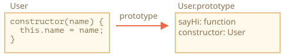

# ไวยากรณ์พื้นฐานของคลาส

```quote author="Wikipedia"
ในแนวคิดการเขียนโปรแกรมเชิงวัตถุ (OOP) *คลาส* คือแม่แบบของโค้ดสำหรับสร้างออบเจ็กต์ โดยกำหนดค่าเริ่มต้นของสถานะ (ตัวแปรสมาชิก) และพฤติกรรม (ฟังก์ชันสมาชิกหรือเมธอด)
```

ในทางปฏิบัติ เรามักจะต้องสร้างออบเจ็กต์จำนวนมากที่มีโครงสร้างเหมือนกัน ไม่ว่าจะเป็นผู้ใช้ สินค้า หรืออะไรก็ตาม

อย่างที่เรารู้จากบท <info:constructor-new> แล้วว่า `new function` ช่วยจัดการเรื่องนี้ได้

แต่ใน JavaScript ยุคใหม่ มีไวยากรณ์ "class" ที่ทำได้มากกว่า และเพิ่มฟีเจอร์ใหม่ๆ ที่มีประโยชน์สำหรับการเขียนโปรแกรมเชิงวัตถุ

## ไวยากรณ์ "class"

โครงสร้างพื้นฐานเป็นแบบนี้:
```js
class MyClass {
  // เมธอดของคลาส
  constructor() { ... }
  method1() { ... }
  method2() { ... }
  method3() { ... }
  ...
}
```

จากนั้นใช้ `new MyClass()` เพื่อสร้างออบเจ็กต์ใหม่ที่มีเมธอดทั้งหมดตามที่ระบุไว้

เมธอด `constructor()` จะถูกเรียกโดยอัตโนมัติเมื่อใช้ `new` ทำให้เรากำหนดค่าเริ่มต้นให้ออบเจ็กต์ได้ตรงนี้

ยกตัวอย่าง:

```js run
class User {

  constructor(name) {
    this.name = name;
  }

  sayHi() {
    alert(this.name);
  }

}

// วิธีใช้งาน:
let user = new User("John");
user.sayHi();
```

เมื่อเรียก `new User("John")` สิ่งที่เกิดขึ้นคือ:
1. สร้างออบเจ็กต์ใหม่ขึ้นมา
2. `constructor` ทำงานโดยรับอาร์กิวเมนต์ที่ส่งมา แล้วกำหนดให้ `this.name`

...หลังจากนั้นก็เรียกเมธอดของออบเจ็กต์ได้เลย เช่น `user.sayHi()`


```warn header="ห้ามใส่จุลภาคระหว่างเมธอดของคลาส"
ข้อผิดพลาดที่มักพบบ่อยสำหรับนักพัฒนามือใหม่คือการใส่จุลภาค (comma) ระหว่างเมธอดของคลาส ซึ่งจะทำให้เกิด syntax error

ไวยากรณ์ตรงนี้ต่างจาก object literal นะ — ภายในคลาสไม่ต้องมีจุลภาคคั่นระหว่างเมธอด
```

## คลาสคืออะไรกันแน่?

แล้ว `class` จริงๆ คืออะไร? มันไม่ได้เป็นสิ่งใหม่ในระดับภาษาอย่างที่หลายคนอาจเข้าใจ

มาเปิดเผยเบื้องหลังกันว่าคลาสจริงๆ แล้วเป็นอะไร เข้าใจตรงนี้แล้วจะช่วยให้เข้าใจเรื่องซับซ้อนอื่นๆ ได้ง่ายขึ้น

ใน JavaScript คลาสก็คือฟังก์ชันชนิดหนึ่งนั่นเอง

ลองดู:

```js run
class User {
  constructor(name) { this.name = name; }
  sayHi() { alert(this.name); }
}

// พิสูจน์: User เป็นฟังก์ชัน
*!*
alert(typeof User); // function
*/!*
```

สิ่งที่ `class User {...}` ทำจริงๆ มีดังนี้:

1. สร้างฟังก์ชันชื่อ `User` ซึ่งเป็นผลลัพธ์ของการประกาศคลาส โดยโค้ดภายในฟังก์ชันมาจากเมธอด `constructor` (ถ้าไม่ได้เขียน `constructor` ไว้ ก็จะเป็นฟังก์ชันว่างๆ)
2. เก็บเมธอดทั้งหมด เช่น `sayHi` ไว้ใน `User.prototype`

เมื่อสร้างออบเจ็กต์ด้วย `new User` แล้วเรียกเมธอด เมธอดนั้นจะถูกดึงมาจากโปรโตไทป์ ตามหลักการที่อธิบายไว้ในบท <info:function-prototype> ทำให้ออบเจ็กต์เข้าถึงเมธอดของคลาสได้

ผลลัพธ์ของการประกาศ `class User` แสดงเป็นภาพได้ดังนี้:



ลองตรวจสอบด้วยโค้ดกัน:

```js run
class User {
  constructor(name) { this.name = name; }
  sayHi() { alert(this.name); }
}

// คลาสก็คือฟังก์ชัน
alert(typeof User); // function

// ...ถ้าจะพูดให้ชัดกว่านั้น ก็คือเมธอด constructor นั่นเอง
alert(User === User.prototype.constructor); // true

// เมธอดต่างๆ อยู่ใน User.prototype เช่น:
alert(User.prototype.sayHi); // โค้ดของเมธอด sayHi

// มีเมธอดอยู่ 2 ตัวใน prototype
alert(Object.getOwnPropertyNames(User.prototype)); // constructor, sayHi
```

## ไม่ใช่แค่น้ำตาลทางไวยากรณ์

บางคนบอกว่า `class` เป็นแค่ "น้ำตาลทางไวยากรณ์ (syntactic sugar)" (ไวยากรณ์ที่ออกแบบมาเพื่อให้อ่านง่ายขึ้น แต่ไม่ได้เพิ่มความสามารถใหม่) เพราะเราสามารถทำสิ่งเดียวกันได้โดยไม่ต้องใช้คีย์เวิร์ด `class` เลย:

```js run
// เขียน class User ใหม่ด้วยฟังก์ชันล้วนๆ

// 1. สร้าง constructor function
function User(name) {
  this.name = name;
}
// function prototype มีพร็อพเพอร์ตี้ "constructor" อยู่แล้วโดยค่าเริ่มต้น
// จึงไม่ต้องสร้างเพิ่ม

// 2. เพิ่มเมธอดเข้าไปที่ prototype
User.prototype.sayHi = function() {
  alert(this.name);
};

// วิธีใช้งาน:
let user = new User("John");
user.sayHi();
```

ผลลัพธ์ที่ได้จากการเขียนแบบนี้ก็แทบจะเหมือนกัน จึงมีเหตุผลที่จะมองว่า `class` เป็นแค่น้ำตาลทางไวยากรณ์สำหรับการนิยาม constructor พร้อมกับเมธอดบน prototype

แต่จริงๆ แล้วมีความแตกต่างที่สำคัญอยู่

1. ประการแรก ฟังก์ชันที่สร้างจาก `class` จะถูกติดป้ายด้วยพร็อพเพอร์ตี้ภายในพิเศษ `[[IsClassConstructor]]: true` จึงไม่เหมือนกับการสร้างฟังก์ชันเองทั้งหมด

    JavaScript ตรวจสอบพร็อพเพอร์ตี้นี้ในหลายจุด ยกตัวอย่างเช่น ต่างจากฟังก์ชันปกติตรงที่ต้องเรียกด้วย `new` เสมอ:

    ```js run
    class User {
      constructor() {}
    }

    alert(typeof User); // function
    User(); // Error: Class constructor User cannot be invoked without 'new'
    ```

    นอกจากนี้ เมื่อแปลง class constructor เป็นสตริง ใน JavaScript engine ส่วนใหญ่จะขึ้นต้นด้วยคำว่า "class..."

    ```js run
    class User {
      constructor() {}
    }

    alert(User); // class User { ... }
    ```
    ยังมีความแตกต่างอื่นๆ อีก ซึ่งเราจะได้เห็นในไม่ช้า

2. เมธอดของคลาสจะ enumerate ไม่ได้
    การประกาศคลาสจะตั้งค่า flag `enumerable` เป็น `false` ให้กับเมธอดทุกตัวใน `"prototype"`

    ซึ่งเป็นเรื่องดี เพราะถ้าใช้ `for..in` วนลูปออบเจ็กต์ เราก็ไม่อยากให้เมธอดของคลาสโผล่มาด้วย

3. คลาสจะใช้ `use strict` เสมอ
    โค้ดทั้งหมดภายในคลาสจะอยู่ใน strict mode โดยอัตโนมัติ

นอกจากนี้ ไวยากรณ์ `class` ยังมีฟีเจอร์อื่นๆ อีกมากที่เราจะศึกษาในบทถัดๆ ไป

## Class Expression

เช่นเดียวกับฟังก์ชัน คลาสก็สามารถนิยามไว้ภายในนิพจน์ ส่งต่อไปเป็นค่า คืนค่าออกมา หรือกำหนดให้ตัวแปรได้

ลองดูตัวอย่าง class expression:

```js
let User = class {
  sayHi() {
    alert("Hello");
  }
};
```

คล้ายกับ Named Function Expression ตรงที่ class expression ก็สามารถมีชื่อได้เช่นกัน

ถ้า class expression มีชื่อ ชื่อนั้นจะมองเห็นได้แค่ภายในคลาสเท่านั้น:

```js run
// "Named Class Expression"
// (ไม่ได้มีคำนี้ใน spec แต่คล้ายกับ Named Function Expression)
let User = class *!*MyClass*/!* {
  sayHi() {
    alert(MyClass); // ชื่อ MyClass มองเห็นได้แค่ภายในคลาส
  }
};

new User().sayHi(); // ทำงานได้ แสดงนิยามของ MyClass

alert(MyClass); // error, ชื่อ MyClass มองไม่เห็นจากภายนอกคลาส
```

เรายังสร้างคลาสแบบไดนามิก "ตามต้องการ" ได้ด้วย:

```js run
function makeClass(phrase) {
  // ประกาศคลาสแล้วคืนค่าออกไป
  return class {
    sayHi() {
      alert(phrase);
    }
  };
}

// สร้างคลาสใหม่
let User = makeClass("Hello");

new User().sayHi(); // Hello
```


## Getter/Setter

เช่นเดียวกับ object literal คลาสก็สามารถมี getter/setter และ computed property ได้

ลองดูตัวอย่างการใช้ `get/set` กับ `user.name`:

```js run
class User {

  constructor(name) {
    // เรียกใช้ setter
    this.name = name;
  }

*!*
  get name() {
*/!*
    return this._name;
  }

*!*
  set name(value) {
*/!*
    if (value.length < 4) {
      alert("ชื่อสั้นเกินไป");
      return;
    }
    this._name = value;
  }

}

let user = new User("John");
alert(user.name); // John

user = new User(""); // ชื่อสั้นเกินไป
```

ในทางเทคนิค การประกาศคลาสแบบนี้ทำงานโดยสร้าง getter และ setter ไว้ใน `User.prototype`

## Computed Name [...]

ลองดูตัวอย่างการใช้ชื่อเมธอดแบบ computed ด้วยวงเล็บเหลี่ยม `[...]`:

```js run
class User {

*!*
  ['say' + 'Hi']() {
*/!*
    alert("Hello");
  }

}

new User().sayHi();
```

ฟีเจอร์นี้จำง่าย เพราะคล้ายกับ object literal เลย

## Class Field

```warn header="เบราว์เซอร์เก่าอาจต้องใช้ polyfill"
Class field เป็นฟีเจอร์ที่เพิ่มเข้ามาไม่นาน
```

ก่อนหน้านี้คลาสของเรามีแต่เมธอด

"Class field" คือไวยากรณ์สำหรับเพิ่มพร็อพเพอร์ตี้ใดๆ เข้าไปในคลาสได้

ยกตัวอย่าง ลองเพิ่มพร็อพเพอร์ตี้ `name` ใน `class User`:

```js run
class User {
*!*
  name = "John";
*/!*

  sayHi() {
    alert(`Hello, ${this.name}!`);
  }
}

new User().sayHi(); // Hello, John!
```

เขียนง่ายมาก แค่ใส่ " = " ตามด้วยค่าในการประกาศ

สิ่งสำคัญที่ต่างจากเมธอดคือ class field จะถูกกำหนดในแต่ละออบเจ็กต์โดยตรง ไม่ได้อยู่ใน `User.prototype`:

```js run
class User {
*!*
  name = "John";
*/!*
}

let user = new User();
alert(user.name); // John
alert(User.prototype.name); // undefined
```

เรายังสามารถกำหนดค่าโดยใช้นิพจน์ที่ซับซ้อนหรือเรียกฟังก์ชันได้ด้วย:

```js run
class User {
*!*
  name = prompt("Name, please?", "John");
*/!*
}

let user = new User();
alert(user.name); // John
```


### สร้าง bound method ด้วย class field

อย่างที่เราเห็นจากบท <info:bind> ฟังก์ชันใน JavaScript มี `this` ที่เปลี่ยนไปตามบริบทของการเรียกใช้

ดังนั้น ถ้านำเมธอดของออบเจ็กต์ไปใช้ในบริบทอื่น `this` จะไม่ชี้กลับไปที่ออบเจ็กต์เดิมอีกต่อไป

ยกตัวอย่าง โค้ดนี้จะแสดง `undefined`:

```js run
class Button {
  constructor(value) {
    this.value = value;
  }

  click() {
    alert(this.value);
  }
}

let button = new Button("hello");

*!*
setTimeout(button.click, 1000); // undefined
*/!*
```

ปัญหานี้เรียกว่า "การสูญเสีย `this`"

มี 2 วิธีแก้ไข ตามที่อธิบายไว้ในบท <info:bind>:

1. ส่งฟังก์ชันห่อหุ้ม (wrapper function) เช่น `setTimeout(() => button.click(), 1000)`
2. ผูกเมธอดกับออบเจ็กต์ เช่น ทำใน constructor

class field มีอีกวิธีที่กระชับดี:

```js run
class Button {
  constructor(value) {
    this.value = value;
  }
*!*
  click = () => {
    alert(this.value);
  }
*/!*
}

let button = new Button("hello");

setTimeout(button.click, 1000); // hello
```

class field `click = () => {...}` จะถูกสร้างขึ้นในแต่ละออบเจ็กต์ แยกฟังก์ชันกันสำหรับ `Button` แต่ละตัว โดย `this` ภายในจะชี้ไปที่ออบเจ็กต์นั้นเสมอ เราจึงส่ง `button.click` ไปที่ไหนก็ได้ และ `this` จะถูกต้องเสมอ

ฟีเจอร์นี้มีประโยชน์มากโดยเฉพาะในเบราว์เซอร์ สำหรับจัดการ event listener

## สรุป

ไวยากรณ์พื้นฐานของคลาสเป็นดังนี้:

```js
class MyClass {
  prop = value; // พร็อพเพอร์ตี้

  constructor(...) { // คอนสตรักเตอร์
    // ...
  }

  method(...) {} // เมธอด

  get something(...) {} // getter
  set something(...) {} // setter

  [Symbol.iterator]() {} // เมธอดที่ใช้ computed name (ในที่นี้เป็น symbol)
  // ...
}
```

`MyClass` ในทางเทคนิคแล้วก็คือฟังก์ชัน (ตัวที่เราเขียนใน `constructor`) ส่วนเมธอด getter และ setter จะถูกเขียนไว้ใน `MyClass.prototype`

ในบทถัดๆ ไป เราจะเรียนรู้เพิ่มเติมเกี่ยวกับคลาส รวมถึงการสืบทอดและฟีเจอร์อื่นๆ
