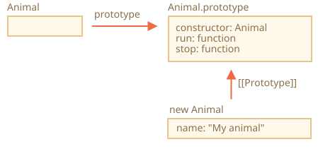
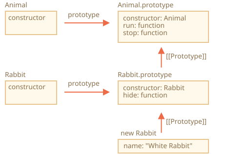
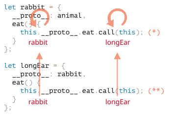
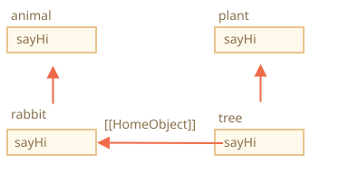

# การสืบทอดคลาส (Class Inheritance)

การสืบทอดคลาสเป็นวิธีที่ทำให้คลาสหนึ่งสามารถขยายความสามารถจากอีกคลาสหนึ่งได้

เราจึงสร้างฟีเจอร์ใหม่ต่อยอดจากสิ่งที่มีอยู่แล้วได้

## คีย์เวิร์ด "extends"

สมมติว่าเรามีคลาส `Animal` แบบนี้:

```js
class Animal {
  constructor(name) {
    this.speed = 0;
    this.name = name;
  }
  run(speed) {
    this.speed = speed;
    alert(`${this.name} runs with speed ${this.speed}.`);
  }
  stop() {
    this.speed = 0;
    alert(`${this.name} stands still.`);
  }
}

let animal = new Animal("My animal");
```

ถ้าวาดเป็นรูป ออบเจ็กต์ `animal` กับคลาส `Animal` จะหน้าตาแบบนี้:



...แล้วเราอยากสร้างอีกคลาสหนึ่งชื่อ `class Rabbit`

เนื่องจากกระต่ายก็เป็นสัตว์ชนิดหนึ่ง คลาส `Rabbit` จึงควรสร้างต่อยอดจาก `Animal` โดยเข้าถึงเมธอดของ Animal ได้ เพื่อให้กระต่ายทำทุกอย่างที่สัตว์ทั่วไปทำได้

ไวยากรณ์สำหรับขยายจากอีกคลาสหนึ่งคือ: `class Child extends Parent`

มาสร้าง `class Rabbit` ที่สืบทอดจาก `Animal` กัน:

```js
*!*
class Rabbit extends Animal {
*/!*
  hide() {
    alert(`${this.name} hides!`);
  }
}

let rabbit = new Rabbit("White Rabbit");

rabbit.run(5); // White Rabbit วิ่งด้วยความเร็ว 5.
rabbit.hide(); // White Rabbit ซ่อนตัว!
```

ออบเจ็กต์ของคลาส `Rabbit` สามารถเรียกใช้ได้ทั้งเมธอดของ `Rabbit` เอง เช่น `rabbit.hide()` และเมธอดของ `Animal` เช่น `rabbit.run()` ด้วย

เบื้องหลังการทำงาน คีย์เวิร์ด `extends` ใช้กลไกโปรโตไทป์ที่เรารู้จักดีอยู่แล้ว มันตั้งค่า `Rabbit.prototype.[[Prototype]]` ให้ชี้ไปที่ `Animal.prototype` ดังนั้นถ้าหาเมธอดใน `Rabbit.prototype` ไม่เจอ JavaScript ก็จะไปหาต่อใน `Animal.prototype`



ยกตัวอย่างเช่น การค้นหาเมธอด `rabbit.run` เอนจินจะตรวจสอบตามลำดับ (จากล่างขึ้นบนในรูป):
1. ออบเจ็กต์ `rabbit` (ไม่มี `run`)
2. โปรโตไทป์ของมัน คือ `Rabbit.prototype` (มี `hide` แต่ไม่มี `run`)
3. โปรโตไทป์ถัดขึ้นไป คือ `Animal.prototype` (ซึ่งเป็นผลจาก `extends`) ในที่สุดก็เจอเมธอด `run` ที่นี่

อย่างที่เราเรียนรู้มาจากบท <info:native-prototypes> ตัว JavaScript เองก็ใช้ prototypal inheritance กับออบเจ็กต์ที่มีมาให้เช่นกัน เช่น `Date.prototype.[[Prototype]]` คือ `Object.prototype` ทำให้ Date เข้าถึงเมธอดทั่วไปของออบเจ็กต์ได้

````smart header="หลัง `extends` ใส่ expression อะไรก็ได้"
ไวยากรณ์ของคลาสอนุญาตให้ระบุไม่เฉพาะแค่ชื่อคลาส แต่ใส่ expression อะไรก็ได้หลัง `extends`

ยกตัวอย่าง การเรียกฟังก์ชันที่สร้างคลาสแม่ขึ้นมา:

```js run
function f(phrase) {
  return class {
    sayHi() { alert(phrase); }
  };
}

*!*
class User extends f("Hello") {}
*/!*

new User().sayHi(); // Hello
```
ในที่นี้ `class User` สืบทอดจากผลลัพธ์ของ `f("Hello")`

เทคนิคนี้มีประโยชน์สำหรับรูปแบบการเขียนโปรแกรมขั้นสูง เมื่อเราต้องการใช้ฟังก์ชันสร้างคลาสตามเงื่อนไขต่างๆ แล้วค่อยสืบทอดจากคลาสเหล่านั้น
````

## การ Override เมธอด

ทีนี้มาดูเรื่องการ override เมธอดกัน โดยปกติแล้ว เมธอดใดที่ไม่ได้กำหนดไว้ใน `class Rabbit` จะถูกนำมาจาก `class Animal` ตรงๆ เลย

แต่ถ้าเรากำหนดเมธอดชื่อเดียวกันไว้ใน `Rabbit` เช่น `stop()` ตัวนี้จะถูกใช้แทน:

```js
class Rabbit extends Animal {
  stop() {
    // ...ตอนนี้เมธอดนี้จะถูกเรียกเมื่อใช้ rabbit.stop()
    // แทนที่ stop() จากคลาส Animal
  }
}
```

แต่โดยทั่วไปแล้ว เรามักไม่ต้องการแทนที่เมธอดจากคลาสแม่ทั้งหมด แต่อยากต่อยอดจากเมธอดเดิม ปรับแต่งหรือเพิ่มความสามารถเข้าไป เราอาจทำอะไรบางอย่างในเมธอดของเรา แล้วเรียกเมธอดของคลาสแม่ก่อน/หลัง หรือระหว่างการทำงาน

คลาสมีคีย์เวิร์ด `"super"` ไว้ใช้สำหรับกรณีนี้

- `super.method(...)` เรียกเมธอดของคลาสแม่
- `super(...)` เรียกคอนสตรักเตอร์ของคลาสแม่ (ใช้ได้เฉพาะภายในคอนสตรักเตอร์เท่านั้น)

ยกตัวอย่าง ให้กระต่ายซ่อนตัวอัตโนมัติเมื่อหยุด:

```js run
class Animal {

  constructor(name) {
    this.speed = 0;
    this.name = name;
  }

  run(speed) {
    this.speed = speed;
    alert(`${this.name} runs with speed ${this.speed}.`);
  }

  stop() {
    this.speed = 0;
    alert(`${this.name} stands still.`);
  }

}

class Rabbit extends Animal {
  hide() {
    alert(`${this.name} hides!`);
  }

*!*
  stop() {
    super.stop(); // เรียก stop ของคลาสแม่
    this.hide(); // แล้วค่อยซ่อนตัว
  }
*/!*
}

let rabbit = new Rabbit("White Rabbit");

rabbit.run(5); // White Rabbit วิ่งด้วยความเร็ว 5.
rabbit.stop(); // White Rabbit หยุดนิ่ง. White Rabbit ซ่อนตัว!
```

ตอนนี้ `Rabbit` มีเมธอด `stop` ที่เรียกเมธอด `super.stop()` ของคลาสแม่ระหว่างทำงาน

````smart header="Arrow function ไม่มี `super`"
ดังที่กล่าวไว้ในบท <info:arrow-functions> arrow function ไม่มี `super` เป็นของตัวเอง

ถ้ามีการเข้าถึง `super` ภายใน arrow function จะไปหยิบมาจากฟังก์ชันภายนอก เช่น:

```js
class Rabbit extends Animal {
  stop() {
    setTimeout(() => super.stop(), 1000); // เรียก stop ของคลาสแม่หลังผ่านไป 1 วินาที
  }
}
```

`super` ใน arrow function จึงเป็นตัวเดียวกับใน `stop()` ทำให้ทำงานได้ถูกต้อง แต่ถ้าใช้ฟังก์ชันปกติจะเกิด error:

```js
// Unexpected super
setTimeout(function() { super.stop() }, 1000);
```
````

## การ Override คอนสตรักเตอร์

เรื่องคอนสตรักเตอร์นี้ค่อนข้างมีรายละเอียดหน่อย

จนถึงตอนนี้ `Rabbit` ยังไม่มีคอนสตรักเตอร์เป็นของตัวเอง

ตาม [สเปค](https://tc39.github.io/ecma262/#sec-runtime-semantics-classdefinitionevaluation) ถ้าคลาสสืบทอดจากคลาสอื่นแล้วไม่มี `constructor` จะมีคอนสตรักเตอร์ "เปล่าๆ" ถูกสร้างขึ้นให้อัตโนมัติดังนี้:

```js
class Rabbit extends Animal {
  // สร้างให้อัตโนมัติสำหรับคลาสลูกที่ไม่มีคอนสตรักเตอร์ของตัวเอง
*!*
  constructor(...args) {
    super(...args);
  }
*/!*
}
```

จะเห็นว่าคอนสตรักเตอร์นี้แค่เรียกคอนสตรักเตอร์ของคลาสแม่แล้วส่ง argument ทั้งหมดต่อให้ ซึ่งจะเกิดขึ้นเมื่อเราไม่ได้เขียนคอนสตรักเตอร์เอง

ทีนี้มาลองเพิ่มคอนสตรักเตอร์ของเราเองให้ `Rabbit` โดยกำหนด `earLength` เพิ่มจาก `name`:

```js run
class Animal {
  constructor(name) {
    this.speed = 0;
    this.name = name;
  }
  // ...
}

class Rabbit extends Animal {

*!*
  constructor(name, earLength) {
    this.speed = 0;
    this.name = name;
    this.earLength = earLength;
  }
*/!*

  // ...
}

*!*
// ใช้ไม่ได้!
let rabbit = new Rabbit("White Rabbit", 10); // Error: this is not defined.
*/!*
```

โอ้โห! เกิด error ขึ้นมา ตอนนี้สร้างกระต่ายไม่ได้แล้ว เกิดอะไรขึ้น?

คำตอบสั้นๆ คือ:

- **คอนสตรักเตอร์ของคลาสลูกต้องเรียก `super(...)` และ (!) ต้องเรียก *ก่อน* ที่จะใช้ `this`**

...แต่ทำไมล่ะ? ที่เป็นแบบนี้เพราะอะไร? ข้อกำหนดนี้ฟังดูแปลกๆ ใช่ไหม?

แน่นอนว่ามีคำอธิบาย มาลงรายละเอียดกัน เพื่อจะได้เข้าใจจริงๆ ว่าเกิดอะไรขึ้น

ใน JavaScript มีความแตกต่างระหว่างคอนสตรักเตอร์ของคลาสลูก (เรียกว่า "derived constructor") กับคอนสตรักเตอร์ทั่วไป โดยคอนสตรักเตอร์ของคลาสลูกจะมีพร็อพเพอร์ตี้ภายในพิเศษ `[[ConstructorKind]]:"derived"` ที่ทำให้พฤติกรรมแตกต่างออกไป

พร็อพเพอร์ตี้นี้ส่งผลต่อพฤติกรรมเมื่อใช้กับ `new`

- เมื่อฟังก์ชันปกติถูกเรียกด้วย `new` จะสร้างออบเจ็กต์เปล่าขึ้นมาแล้วกำหนดให้ `this`
- แต่เมื่อ derived constructor ทำงาน จะ *ไม่ได้* สร้างออบเจ็กต์เอง แต่คาดหวังให้คอนสตรักเตอร์ของคลาสแม่เป็นคนสร้างให้

ดังนั้น derived constructor จึงต้องเรียก `super` เพื่อให้คอนสตรักเตอร์ของคลาสแม่ (base) ทำงาน ไม่เช่นนั้นออบเจ็กต์สำหรับ `this` จะไม่ถูกสร้างขึ้น แล้วก็จะเกิด error

เพื่อให้คอนสตรักเตอร์ของ `Rabbit` ทำงานได้ ต้องเรียก `super()` ก่อนใช้ `this` แบบนี้:

```js run
class Animal {

  constructor(name) {
    this.speed = 0;
    this.name = name;
  }

  // ...
}

class Rabbit extends Animal {

  constructor(name, earLength) {
*!*
    super(name);
*/!*
    this.earLength = earLength;
  }

  // ...
}

*!*
// ตอนนี้ใช้ได้แล้ว
let rabbit = new Rabbit("White Rabbit", 10);
alert(rabbit.name); // White Rabbit
alert(rabbit.earLength); // 10
*/!*
```

### การ Override ฟิลด์ของคลาส: จุดที่ต้องระวัง

```warn header="หมายเหตุขั้นสูง"
หมายเหตุนี้เหมาะสำหรับผู้ที่มีประสบการณ์ใช้คลาสมาบ้างแล้ว อาจเป็นจากภาษาอื่นก็ได้

เนื้อหาส่วนนี้จะช่วยให้เข้าใจภาษาลึกขึ้น และอธิบายพฤติกรรมที่อาจเป็นแหล่งที่มาของ bug (แม้จะไม่บ่อยนัก)

ถ้ารู้สึกว่ายากเกินไป ข้ามไปก่อนได้เลย แล้วค่อยกลับมาอ่านทีหลัง
```

เรา override ได้ไม่เฉพาะเมธอด แต่ override ฟิลด์ของคลาสได้ด้วย

แต่มีพฤติกรรมที่ค่อนข้างแปลก เมื่อเข้าถึงฟิลด์ที่ถูก override ภายในคอนสตรักเตอร์ของคลาสแม่ ซึ่งต่างจากภาษาโปรแกรมอื่นๆ มาก

ลองดูตัวอย่างนี้:

```js run
class Animal {
  name = 'animal';

  constructor() {
    alert(this.name); // (*)
  }
}

class Rabbit extends Animal {
  name = 'rabbit';
}

new Animal(); // animal
*!*
new Rabbit(); // animal
*/!*
```

ในที่นี้ คลาส `Rabbit` สืบทอดจาก `Animal` แล้ว override ฟิลด์ `name` ด้วยค่าของตัวเอง

`Rabbit` ไม่มีคอนสตรักเตอร์ของตัวเอง จึงเรียกคอนสตรักเตอร์ของ `Animal` แทน

สิ่งที่น่าสนใจคือ ทั้ง `new Animal()` และ `new Rabbit()` ต่าง `alert` ในบรรทัด `(*)` แสดงผลเป็น `animal` ทั้งคู่

**พูดอีกอย่างก็คือ คอนสตรักเตอร์ของคลาสแม่จะใช้ค่าฟิลด์ของตัวเองเสมอ ไม่ใช่ค่าที่ถูก override**

แปลกไหม?

ถ้ายังไม่ชัด ลองเปรียบเทียบกับเมธอดดู

โค้ดด้านล่างเหมือนกัน แต่เปลี่ยนจากฟิลด์ `this.name` เป็นการเรียกเมธอด `this.showName()` แทน:

```js run
class Animal {
  showName() {  // แทน this.name = 'animal'
    alert('animal');
  }

  constructor() {
    this.showName(); // แทน alert(this.name);
  }
}

class Rabbit extends Animal {
  showName() {
    alert('rabbit');
  }
}

new Animal(); // animal
*!*
new Rabbit(); // rabbit
*/!*
```

สังเกตว่าผลลัพธ์ต่างกันแล้ว

และนี่คือสิ่งที่เราคาดหวัง เมื่อคอนสตรักเตอร์ของคลาสแม่ถูกเรียกในคลาสลูก จะใช้เมธอดที่ถูก override แล้ว

...แต่กับฟิลด์กลับไม่เป็นเช่นนั้น ดังที่กล่าวไป คอนสตรักเตอร์ของคลาสแม่จะใช้ฟิลด์ของคลาสแม่เสมอ

ทำไมถึงแตกต่างกัน?

เหตุผลก็คือลำดับการ initialize ฟิลด์ต่างกัน โดยฟิลด์ของคลาสจะถูก initialize ดังนี้:
- *ก่อน* คอนสตรักเตอร์ สำหรับคลาสฐาน (base class) ที่ไม่ได้สืบทอดจากใคร
- *ทันทีหลัง* `super()` สำหรับคลาสลูก (derived class)

ในกรณีของเรา `Rabbit` เป็นคลาสลูก ไม่มี `constructor()` ของตัวเอง ซึ่งก็เหมือนกับมีคอนสตรักเตอร์เปล่าๆ ที่มีแค่ `super(...args)` อยู่ข้างใน

ดังนั้นเมื่อ `new Rabbit()` เรียก `super()` ก็จะเข้าสู่คอนสตรักเตอร์ของคลาสแม่ และ (ตามกฎของคลาสลูก) ฟิลด์ของ `Rabbit` จะถูก initialize หลังจากนั้น ขณะที่คอนสตรักเตอร์ของคลาสแม่ทำงาน ฟิลด์ของ `Rabbit` จึงยังไม่มี จึงต้องใช้ฟิลด์ของ `Animal` แทน

ความแตกต่างอันละเอียดอ่อนระหว่างฟิลด์กับเมธอดนี้ เป็นพฤติกรรมเฉพาะของ JavaScript

โชคดีที่พฤติกรรมนี้จะเป็นปัญหาก็ต่อเมื่อใช้ฟิลด์ที่ถูก override ภายในคอนสตรักเตอร์ของคลาสแม่เท่านั้น ซึ่งอาจทำให้สับสนได้ จึงอธิบายไว้ตรงนี้

ถ้าเจอปัญหานี้ แก้ได้โดยใช้เมธอดหรือ getter/setter แทนฟิลด์

## Super: เบื้องลึก, [[HomeObject]]

```warn header="ข้อมูลขั้นสูง"
ถ้าอ่าน tutorial นี้เป็นครั้งแรก อาจข้ามส่วนนี้ไปก่อนได้

เนื้อหาส่วนนี้เจาะลึกเรื่องกลไกภายในของการสืบทอดและ `super`
```

มาเจาะลึกเบื้องหลังการทำงานของ `super` กัน จะได้เห็นสิ่งน่าสนใจระหว่างทาง

อันดับแรกต้องบอกว่า จากทุกอย่างที่เราเรียนมา `super` ไม่น่าจะทำงานได้เลย!

จริงๆ นะ ลองคิดดูว่ามันควรทำงานอย่างไร เมื่อเมธอดของออบเจ็กต์ทำงาน จะได้ออบเจ็กต์ปัจจุบันเป็น `this` ถ้าเราเรียก `super.method()` เอนจินก็ต้องหา `method` จากโปรโตไทป์ของออบเจ็กต์ปัจจุบัน แต่ทำยังไงล่ะ?

ดูเหมือนง่าย แต่ไม่ง่ายเลย เอนจินรู้จักออบเจ็กต์ปัจจุบัน `this` ก็จริง จึงน่าจะหาเมธอดจากคลาสแม่ได้ด้วย `this.__proto__.method` แต่น่าเสียดาย วิธี "ซื่อๆ" แบบนี้ใช้ไม่ได้

มาดูตัวอย่างปัญหากัน ใช้ออบเจ็กต์ธรรมดาแทนคลาสเพื่อให้เข้าใจง่ายขึ้น

ถ้าไม่อยากรู้รายละเอียด ข้ามไปที่หัวข้อย่อย `[[HomeObject]]` ด้านล่างได้เลย จะไม่มีผลอะไร หรือถ้าสนใจเจาะลึกก็อ่านต่อได้

ในตัวอย่างด้านล่าง `rabbit.__proto__ = animal` ทีนี้ลองมาดูว่า ถ้าใน `rabbit.eat()` เราเรียก `animal.eat()` ผ่าน `this.__proto__` จะเป็นอย่างไร:

```js run
let animal = {
  name: "Animal",
  eat() {
    alert(`${this.name} eats.`);
  }
};

let rabbit = {
  __proto__: animal,
  name: "Rabbit",
  eat() {
*!*
    // super.eat() น่าจะทำงานแบบนี้
    this.__proto__.eat.call(this); // (*)
*/!*
  }
};

rabbit.eat(); // Rabbit กินอาหาร.
```

ที่บรรทัด `(*)` เราหยิบ `eat` จากโปรโตไทป์ (`animal`) แล้วเรียกในบริบทของออบเจ็กต์ปัจจุบัน สังเกตว่า `.call(this)` สำคัญมาก เพราะถ้าเรียกแค่ `this.__proto__.eat()` จะรันเมธอด `eat` ในบริบทของโปรโตไทป์ ไม่ใช่ออบเจ็กต์ปัจจุบัน

และในโค้ดข้างต้นก็ทำงานได้ถูกต้อง `alert` แสดงผลตามที่ต้องการ

ทีนี้ลองเพิ่มออบเจ็กต์อีกตัวเข้าไปในสาย chain แล้วจะเห็นว่ามีปัญหา:

```js run
let animal = {
  name: "Animal",
  eat() {
    alert(`${this.name} eats.`);
  }
};

let rabbit = {
  __proto__: animal,
  eat() {
    // ...ทำอะไรบางอย่างแบบกระต่าย แล้วเรียกเมธอดของคลาสแม่ (animal)
    this.__proto__.eat.call(this); // (*)
  }
};

let longEar = {
  __proto__: rabbit,
  eat() {
    // ...ทำอะไรบางอย่างกับหูยาว แล้วเรียกเมธอดของคลาสแม่ (rabbit)
    this.__proto__.eat.call(this); // (**)
  }
};

*!*
longEar.eat(); // Error: Maximum call stack size exceeded
*/!*
```

โค้ดใช้ไม่ได้แล้ว! เกิด error เมื่อเรียก `longEar.eat()`

อาจไม่เห็นชัดนัก แต่ถ้าไล่การทำงานของ `longEar.eat()` จะเข้าใจว่าทำไม ทั้งบรรทัด `(*)` และ `(**)` ค่าของ `this` คือออบเจ็กต์ปัจจุบัน (`longEar`) ทั้งคู่ จุดนี้สำคัญมาก เพราะเมธอดของออบเจ็กต์ทุกตัวจะได้ออบเจ็กต์ปัจจุบันเป็น `this` ไม่ใช่โปรโตไทป์

ดังนั้น ทั้งบรรทัด `(*)` และ `(**)` ค่าของ `this.__proto__` จึงเป็น `rabbit` เหมือนกัน ทำให้ทั้งคู่เรียก `rabbit.eat` โดยไม่เคยไปถึงขั้นที่สูงกว่าใน chain วนลูปไม่รู้จบ

นี่คือรูปแสดงสิ่งที่เกิดขึ้น:



1. ภายใน `longEar.eat()` บรรทัด `(**)` เรียก `rabbit.eat` โดยส่ง `this=longEar`
    ```js
    // ภายใน longEar.eat() เรามี this = longEar
    this.__proto__.eat.call(this) // (**)
    // กลายเป็น
    longEar.__proto__.eat.call(this)
    // ซึ่งก็คือ
    rabbit.eat.call(this);
    ```
2. จากนั้นในบรรทัด `(*)` ของ `rabbit.eat` เราต้องการส่งการเรียกขึ้นไปอีกขั้น แต่ `this=longEar` ทำให้ `this.__proto__.eat` ก็เป็น `rabbit.eat` อีก!

    ```js
    // ภายใน rabbit.eat() เรามี this = longEar เช่นกัน
    this.__proto__.eat.call(this) // (*)
    // กลายเป็น
    longEar.__proto__.eat.call(this)
    // หรือ (อีกครั้ง)
    rabbit.eat.call(this);
    ```

3. ...`rabbit.eat` จึงเรียกตัวเองซ้ำไปเรื่อยๆ เพราะไม่สามารถขึ้นไปอีกขั้นได้

ปัญหานี้แก้ไม่ได้ด้วย `this` เพียงอย่างเดียว

### `[[HomeObject]]`

เพื่อแก้ปัญหานี้ JavaScript จึงเพิ่มพร็อพเพอร์ตี้ภายในพิเศษอีกตัวหนึ่งให้กับฟังก์ชัน ชื่อว่า `[[HomeObject]]`

เมื่อฟังก์ชันถูกกำหนดให้เป็นเมธอดของคลาสหรือออบเจ็กต์ พร็อพเพอร์ตี้ `[[HomeObject]]` จะชี้ไปที่ออบเจ็กต์นั้น

จากนั้น `super` จะใช้ `[[HomeObject]]` เพื่อค้นหาโปรโตไทป์ของคลาสแม่และเมธอดที่ต้องการ

มาดูวิธีการทำงานกัน เริ่มจากออบเจ็กต์ธรรมดา:

```js run
let animal = {
  name: "Animal",
  eat() {         // animal.eat.[[HomeObject]] == animal
    alert(`${this.name} eats.`);
  }
};

let rabbit = {
  __proto__: animal,
  name: "Rabbit",
  eat() {         // rabbit.eat.[[HomeObject]] == rabbit
    super.eat();
  }
};

let longEar = {
  __proto__: rabbit,
  name: "Long Ear",
  eat() {         // longEar.eat.[[HomeObject]] == longEar
    super.eat();
  }
};

*!*
// ทำงานได้ถูกต้อง
longEar.eat();  // Long Ear กินอาหาร.
*/!*
```

ทำงานได้ถูกต้อง เพราะกลไก `[[HomeObject]]` แต่ละเมธอด เช่น `longEar.eat` จะรู้จัก `[[HomeObject]]` ของตัวเอง แล้วหยิบเมธอดจากคลาสแม่ผ่านโปรโตไทป์ โดยไม่ต้องใช้ `this` เลย

### เมธอดไม่ได้ "อิสระ"

ก่อนหน้านี้เราเรียนรู้มาว่า ฟังก์ชันใน JavaScript โดยปกติแล้ว "อิสระ" ไม่ได้ผูกกับออบเจ็กต์ใด จึงก็อปปี้ไปมาระหว่างออบเจ็กต์และเรียกด้วย `this` ตัวอื่นได้

แต่การมีอยู่ของ `[[HomeObject]]` ทำลายหลักการนั้น เพราะเมธอดจำออบเจ็กต์ของตัวเองไว้ `[[HomeObject]]` เปลี่ยนไม่ได้ การผูกนี้จึงเป็นตลอดไป

ที่เดียวในภาษาที่ใช้ `[[HomeObject]]` ก็คือ `super` ดังนั้นถ้าเมธอดไม่ได้ใช้ `super` ก็ยังถือว่าอิสระและก็อปปี้ไปมาได้ตามปกติ แต่ถ้ามี `super` อาจมีปัญหาได้

ลองดูตัวอย่างที่ `super` ทำงานผิดหลังจากก็อปปี้เมธอด:

```js run
let animal = {
  sayHi() {
    alert(`I'm an animal`);
  }
};

// rabbit สืบทอดจาก animal
let rabbit = {
  __proto__: animal,
  sayHi() {
    super.sayHi();
  }
};

let plant = {
  sayHi() {
    alert("I'm a plant");
  }
};

// tree สืบทอดจาก plant
let tree = {
  __proto__: plant,
*!*
  sayHi: rabbit.sayHi // (*)
*/!*
};

*!*
tree.sayHi();  // ฉันเป็นสัตว์ (?!?)
*/!*
```

เมื่อเรียก `tree.sayHi()` ได้ผลว่า "ฉันเป็นสัตว์" ซึ่งผิดอย่างแน่นอน

เหตุผลก็ง่ายๆ:
- ที่บรรทัด `(*)` เมธอด `tree.sayHi` ถูกก็อปปี้มาจาก `rabbit` อาจจะแค่ต้องการลดโค้ดซ้ำ?
- `[[HomeObject]]` ของเมธอดนี้คือ `rabbit` เพราะถูกสร้างไว้ใน `rabbit` และ `[[HomeObject]]` เปลี่ยนไม่ได้
- โค้ดของ `tree.sayHi()` มี `super.sayHi()` อยู่ข้างใน ซึ่งไล่ขึ้นไปจาก `rabbit` จึงหยิบเมธอดจาก `animal` มา

นี่คือไดอะแกรมแสดงสิ่งที่เกิดขึ้น:



### ต้องเป็นเมธอด ไม่ใช่ function property

`[[HomeObject]]` ถูกกำหนดให้กับเมธอดทั้งในคลาสและออบเจ็กต์ธรรมดา แต่สำหรับออบเจ็กต์ต้องเขียนในรูปแบบ `method()` ไม่ใช่ `"method: function()"`

ความแตกต่างนี้อาจไม่สำคัญสำหรับเรา แต่สำคัญสำหรับ JavaScript

ในตัวอย่างด้านล่างใช้ไวยากรณ์แบบ non-method เพื่อเปรียบเทียบ พร็อพเพอร์ตี้ `[[HomeObject]]` จะไม่ถูกกำหนด ทำให้การสืบทอดไม่ทำงาน:

```js run
let animal = {
  eat: function() { // ตั้งใจเขียนแบบนี้แทน eat() {...
    // ...
  }
};

let rabbit = {
  __proto__: animal,
  eat: function() {
    super.eat();
  }
};

*!*
rabbit.eat();  // Error calling super (เพราะไม่มี [[HomeObject]])
*/!*
```

## สรุป

1. การขยายคลาส: `class Child extends Parent`:
    - หมายความว่า `Child.prototype.__proto__` จะเป็น `Parent.prototype` ทำให้เมธอดถูกสืบทอดลงมา
2. เมื่อ override คอนสตรักเตอร์:
    - ต้องเรียกคอนสตรักเตอร์ของคลาสแม่ด้วย `super()` ภายในคอนสตรักเตอร์ของ `Child` ก่อนที่จะใช้ `this`
3. เมื่อ override เมธอดอื่น:
    - ใช้ `super.method()` ในเมธอดของ `Child` เพื่อเรียกเมธอดของ `Parent`
4. เบื้องหลัง:
    - เมธอดจำคลาส/ออบเจ็กต์ของตัวเองไว้ในพร็อพเพอร์ตี้ภายใน `[[HomeObject]]` นี่คือวิธีที่ `super` ค้นหาเมธอดของคลาสแม่
    - ดังนั้นการก็อปปี้เมธอดที่มี `super` ไปยังออบเจ็กต์อื่นจึงไม่ปลอดภัย

นอกจากนี้:
- Arrow function ไม่มี `this` หรือ `super` ของตัวเอง จึงกลมกลืนไปกับบริบทรอบข้างได้อย่างเป็นธรรมชาติ
