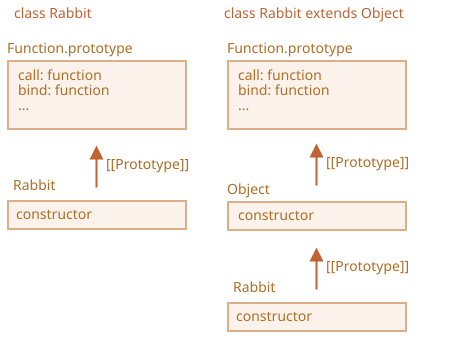

มาดูกันก่อนว่าทำไมโค้ดด้านบนถึงใช้ไม่ได้

สาเหตุจะเห็นชัดเมื่อลองรันดู คลาสลูกที่สืบทอดมาจำเป็นต้องเรียก `super()` ในคอนสตรักเตอร์ ไม่อย่างนั้น `"this"` จะยังไม่ถูกกำหนดค่า

แก้ไขได้ดังนี้:

```js run
class Rabbit extends Object {
  constructor(name) {
*!*
    super(); // ต้องเรียกคอนสตรักเตอร์ของคลาสแม่เมื่อมีการสืบทอด
*/!*
    this.name = name;
  }
}

let rabbit = new Rabbit("Rab");

alert( rabbit.hasOwnProperty('name') ); // true
```

แต่ยังไม่จบแค่นี้

แม้แก้ไขแล้ว ยังมีความแตกต่างสำคัญระหว่าง `"class Rabbit extends Object"` กับ `class Rabbit` ธรรมดา

อย่างที่เราทราบ ไวยากรณ์ "extends" สร้างการเชื่อมโยงโปรโตไทป์ 2 จุด:

1. ระหว่าง `"prototype"` ของคอนสตรักเตอร์ (สำหรับเมธอดปกติ)
2. ระหว่างตัวคอนสตรักเตอร์เอง (สำหรับเมธอด static)

ในกรณีของ `class Rabbit extends Object` จะเป็นแบบนี้:

```js run
class Rabbit extends Object {}

alert( Rabbit.prototype.__proto__ === Object.prototype ); // (1) true
alert( Rabbit.__proto__ === Object ); // (2) true
```

ดังนั้น `Rabbit` จึงเข้าถึงเมธอด static ของ `Object` ผ่านตัว `Rabbit` ได้เลย เช่น:

```js run
class Rabbit extends Object {}

*!*
// ปกติเราเรียก Object.getOwnPropertyNames
alert ( Rabbit.getOwnPropertyNames({a: 1, b: 2})); // a,b
*/!*
```

แต่ถ้าไม่มี `extends Object` ค่า `Rabbit.__proto__` จะไม่ชี้ไปที่ `Object`

ลองดูตัวอย่าง:

```js run
class Rabbit {}

alert( Rabbit.prototype.__proto__ === Object.prototype ); // (1) true
alert( Rabbit.__proto__ === Object ); // (2) false (!)
alert( Rabbit.__proto__ === Function.prototype ); // เป็นค่าเริ่มต้นของทุกฟังก์ชัน

*!*
// ไม่มีฟังก์ชันนี้ใน Rabbit
alert ( Rabbit.getOwnPropertyNames({a: 1, b: 2})); // Error
*/!*
```

ในกรณีนี้ `Rabbit` จึงเข้าถึงเมธอด static ของ `Object` ไม่ได้

อีกอย่าง `Function.prototype` ก็มีเมธอดทั่วไปของฟังก์ชัน เช่น `call`, `bind` เป็นต้น ซึ่งใช้ได้ทั้งสองกรณี เพราะคอนสตรักเตอร์ `Object` ในตัวก็มี `Object.__proto__ === Function.prototype` เช่นกัน

ภาพประกอบ:



สรุปสั้นๆ ความแตกต่างมีสองข้อ:

| class Rabbit | class Rabbit extends Object  |
|--------------|------------------------------|
| --             | ต้องเรียก `super()` ในคอนสตรักเตอร์ |
| `Rabbit.__proto__ === Function.prototype` | `Rabbit.__proto__ === Object` |
