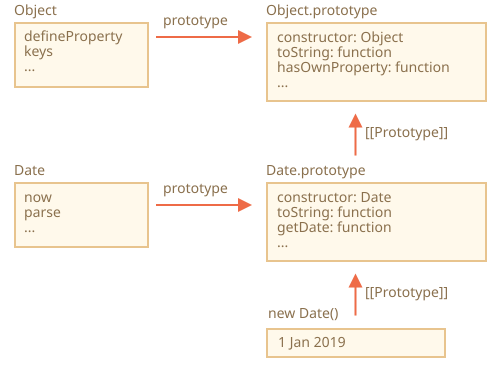

# การสืบทอดคลาสที่มีอยู่แล้วในภาษา

คลาสที่มีอยู่แล้วในตัว (built-in) อย่าง Array, Map และอื่นๆ สามารถถูกสืบทอดได้เช่นกัน

ยกตัวอย่างเช่น `PowerArray` ที่สืบทอดจาก `Array`:

```js run
// เพิ่มเมธอดเข้าไป (จะเพิ่มอีกกี่ตัวก็ได้)
class PowerArray extends Array {
  isEmpty() {
    return this.length === 0;
  }
}

let arr = new PowerArray(1, 2, 5, 10, 50);
alert(arr.isEmpty()); // false

let filteredArr = arr.filter(item => item >= 10);
alert(filteredArr); // 10, 50
alert(filteredArr.isEmpty()); // false
```

สังเกตจุดที่น่าสนใจมากตรงนี้ เมธอดของ built-in อย่าง `filter`, `map` และอื่นๆ จะคืนค่าเป็นออบเจ็กต์ของคลาสที่สืบทอดมา นั่นก็คือ `PowerArray` นั่นเอง เบื้องหลังการทำงานนั้นใช้พร็อพเพอร์ตี้ `constructor` ของออบเจ็กต์เป็นตัวกำหนด

จากตัวอย่างข้างบน
```js
arr.constructor === PowerArray
```

เมื่อเรียก `arr.filter()` ตัว JavaScript จะสร้างอาร์เรย์ผลลัพธ์ใหม่โดยใช้ `arr.constructor` ไม่ใช่ `Array` ธรรมดา ข้อดีก็คือเราสามารถใช้เมธอดของ `PowerArray` ต่อกับผลลัพธ์ได้เลย

ยิ่งไปกว่านั้น เรายังปรับแต่งพฤติกรรมนี้ได้อีกด้วย

วิธีการคือเพิ่ม static getter ชื่อ `Symbol.species` เข้าไปในคลาส ถ้ามี getter ตัวนี้อยู่ JavaScript จะใช้คอนสตรักเตอร์ที่มันคืนค่ามาในการสร้างออบเจ็กต์ใหม่ใน `map`, `filter` และเมธอดอื่นๆ

ถ้าต้องการให้เมธอดอย่าง `map` หรือ `filter` คืนค่าเป็น `Array` ธรรมดา ก็แค่ return `Array` ใน `Symbol.species` แบบนี้:

```js run
class PowerArray extends Array {
  isEmpty() {
    return this.length === 0;
  }

*!*
  // เมธอด built-in จะใช้ตัวนี้เป็นคอนสตรักเตอร์
  static get [Symbol.species]() {
    return Array;
  }
*/!*
}

let arr = new PowerArray(1, 2, 5, 10, 50);
alert(arr.isEmpty()); // false

// filter สร้างอาร์เรย์ใหม่โดยใช้ arr.constructor[Symbol.species] เป็นคอนสตรักเตอร์
let filteredArr = arr.filter(item => item >= 10);

*!*
// filteredArr ไม่ใช่ PowerArray แต่เป็น Array ธรรมดา
*/!*
alert(filteredArr.isEmpty()); // Error: filteredArr.isEmpty is not a function
```

จะเห็นว่าตอนนี้ `.filter` คืนค่าเป็น `Array` ธรรมดาแล้ว ฟังก์ชันเสริมที่เราเพิ่มไว้จึงไม่ถูกส่งต่อไปด้วย

```smart header="คอลเลกชันอื่นๆ ก็ทำงานในลักษณะเดียวกัน"
คอลเลกชันอื่นๆ เช่น `Map` และ `Set` ก็ใช้ `Symbol.species` ในแบบเดียวกัน
```

## Static method ไม่ถูกสืบทอดใน built-in

ออบเจ็กต์ built-in มี static method เป็นของตัวเอง เช่น `Object.keys`, `Array.isArray` เป็นต้น

อย่างที่เราทราบกันแล้ว คลาส built-in ก็สืบทอดกันเป็นลำดับ เช่น `Array` สืบทอดจาก `Object`

ปกติแล้วเมื่อคลาสหนึ่งสืบทอดจากอีกคลาส ทั้ง static method และ non-static method จะถูกสืบทอดไปด้วย ซึ่งอธิบายไว้แล้วในบทความ [](info:static-properties-methods#statics-and-inheritance)

แต่คลาส built-in เป็นข้อยกเว้น เพราะ static method จะไม่ถูกสืบทอดระหว่างกัน

ยกตัวอย่างเช่น ทั้ง `Array` และ `Date` ต่างก็สืบทอดจาก `Object` ดังนั้นอินสแตนซ์ของทั้งสองจึงมีเมธอดจาก `Object.prototype` ให้ใช้ได้ แต่ `Array.[[Prototype]]` ไม่ได้อ้างอิงไปยัง `Object` จึงไม่มี static method อย่าง `Array.keys()` (หรือ `Date.keys()`)

ลองดูแผนภาพโครงสร้างของ `Date` กับ `Object`:



จะเห็นว่า `Date` กับ `Object` ไม่ได้เชื่อมกัน ทั้งสองเป็นอิสระจากกัน มีแค่ `Date.prototype` เท่านั้นที่สืบทอดจาก `Object.prototype`

นี่คือความแตกต่างสำคัญของการสืบทอดในออบเจ็กต์ built-in เมื่อเทียบกับการสืบทอดผ่าน `extends` ที่เราใช้กันปกติ
