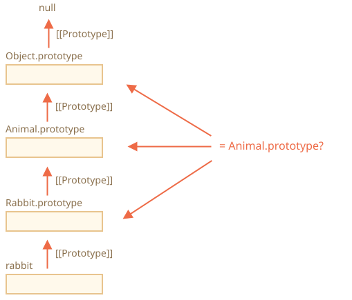

# การตรวจสอบคลาส: "instanceof"

ตัวดำเนินการ `instanceof` ใช้ตรวจสอบว่าออบเจ็กต์นั้นเป็นอินสแตนซ์ของคลาสใดคลาสหนึ่งหรือไม่ โดยตรวจสอบรวมถึงการสืบทอดด้วย

การตรวจสอบแบบนี้จำเป็นในหลายสถานการณ์ ยกตัวอย่างเช่น ใช้สร้างฟังก์ชันแบบ *polymorphic* ที่จัดการอาร์กิวเมนต์ต่างกันตามชนิดของข้อมูล

## ตัวดำเนินการ instanceof [#ref-instanceof]

รูปแบบการเขียนเป็นดังนี้:
```js
obj instanceof Class
```

จะคืนค่า `true` ถ้า `obj` เป็นอินสแตนซ์ของ `Class` หรือคลาสที่สืบทอดมาจากคลาสนั้น

ตัวอย่างเช่น:

```js run
class Rabbit {}
let rabbit = new Rabbit();

// rabbit เป็นออบเจ็กต์ของคลาส Rabbit ไหม?
*!*
alert( rabbit instanceof Rabbit ); // true
*/!*
```

ใช้ได้กับคอนสตรักเตอร์ฟังก์ชันเช่นกัน:

```js run
*!*
// ใช้ฟังก์ชันแทนคลาส
function Rabbit() {}
*/!*

alert( new Rabbit() instanceof Rabbit ); // true
```

...รวมถึงคลาสมาตรฐานอย่าง `Array` ด้วย:

```js run
let arr = [1, 2, 3];
alert( arr instanceof Array ); // true
alert( arr instanceof Object ); // true
```

สังเกตว่า `arr` จัดอยู่ในคลาส `Object` ด้วยเช่นกัน เพราะ `Array` สืบทอดมาจาก `Object` ผ่านทางโปรโตไทป์นั่นเอง

ปกติแล้ว `instanceof` จะตรวจสอบโดยไล่ดูตาม prototype chain แต่เราสามารถกำหนดตรรกะเองได้ผ่าน static method `Symbol.hasInstance`

อัลกอริทึมของ `obj instanceof Class` ทำงานคร่าวๆ ดังนี้:

1. ถ้ามี static method `Symbol.hasInstance` อยู่ ก็เรียกใช้เลย: `Class[Symbol.hasInstance](obj)` ซึ่งจะคืนค่า `true` หรือ `false` แค่นี้ก็จบ นี่คือวิธีที่เราปรับแต่งพฤติกรรมของ `instanceof` ได้

    ตัวอย่างเช่น:

    ```js run
    // กำหนดให้ instanceof ถือว่า
    // ถ้ามีพร็อพเพอร์ตี้ canEat แสดงว่าเป็นสัตว์
    class Animal {
      static [Symbol.hasInstance](obj) {
        if (obj.canEat) return true;
      }
    }

    let obj = { canEat: true };

    alert(obj instanceof Animal); // true: เรียก Animal[Symbol.hasInstance](obj)
    ```

2. คลาสส่วนใหญ่ไม่มี `Symbol.hasInstance` กรณีนี้จะใช้ตรรกะปกติ คือ `obj instanceof Class` จะตรวจว่า `Class.prototype` ตรงกับโปรโตไทป์ตัวใดตัวหนึ่งใน prototype chain ของ `obj` หรือไม่

    พูดง่ายๆ ก็คือเปรียบเทียบทีละตัวตามลำดับ:
    ```js
    obj.__proto__ === Class.prototype?
    obj.__proto__.__proto__ === Class.prototype?
    obj.__proto__.__proto__.__proto__ === Class.prototype?
    ...
    // ถ้าตรงกับตัวไหนก็คืนค่า true
    // แต่ถ้าไล่จนสุดสายแล้วไม่ตรงสักตัว ก็คืนค่า false
    ```

    จากตัวอย่างข้างต้น `rabbit.__proto__ === Rabbit.prototype` ตรงกันเลยตั้งแต่ขั้นแรก จึงได้คำตอบทันที

    แต่ถ้ามีการสืบทอด จะตรงกันที่ขั้นที่สอง:

    ```js run
    class Animal {}
    class Rabbit extends Animal {}

    let rabbit = new Rabbit();
    *!*
    alert(rabbit instanceof Animal); // true
    */!*

    // rabbit.__proto__ === Animal.prototype (ไม่ตรง)
    *!*
    // rabbit.__proto__.__proto__ === Animal.prototype (ตรง!)
    */!*
    ```

นี่คือภาพแสดงสิ่งที่ `rabbit instanceof Animal` เปรียบเทียบกับ `Animal.prototype`:



นอกจากนี้ยังมีเมธอด [objA.isPrototypeOf(objB)](mdn:js/object/isPrototypeOf) ที่คืนค่า `true` ถ้า `objA` อยู่ใน prototype chain ของ `objB` ดังนั้น `obj instanceof Class` จึงเขียนอีกแบบได้เป็น `Class.prototype.isPrototypeOf(obj)`

ที่น่าสนใจคือ ตัวคอนสตรักเตอร์ `Class` เองไม่ได้มีส่วนร่วมในการตรวจสอบเลย! สิ่งที่มีผลคือ prototype chain และ `Class.prototype` เท่านั้น

เรื่องนี้อาจทำให้เกิดผลลัพธ์ที่น่าแปลกใจ เมื่อพร็อพเพอร์ตี้ `prototype` ถูกเปลี่ยนหลังจากสร้างออบเจ็กต์ไปแล้ว

ลองดูตัวอย่างนี้:

```js run
function Rabbit() {}
let rabbit = new Rabbit();

// เปลี่ยน prototype
Rabbit.prototype = {};

// ...ไม่ใช่กระต่ายอีกต่อไปแล้ว!
*!*
alert( rabbit instanceof Rabbit ); // false
*/!*
```

## โบนัส: Object.prototype.toString สำหรับตรวจชนิดข้อมูล

เรารู้แล้วว่าออบเจ็กต์ธรรมดาเมื่อแปลงเป็นสตริงจะได้ `[object Object]`:

```js run
let obj = {};

alert(obj); // [object Object]
alert(obj.toString()); // เหมือนกัน
```

นี่คือการทำงานของ `toString` ของออบเจ็กต์ แต่จริงๆ แล้วมีความสามารถซ่อนอยู่ที่ทำให้ `toString` ทรงพลังกว่าที่คิดมาก เราสามารถใช้มันเป็น `typeof` เวอร์ชันอัปเกรด และเป็นตัวเลือกแทน `instanceof` ได้เลย

ฟังดูแปลกใช่ไหม? มาดูกันว่าทำได้อย่างไร

ตาม[สเปก](https://tc39.github.io/ecma262/#sec-object.prototype.tostring) เราสามารถดึงเมธอด `toString` มาตรฐานออกมาจากออบเจ็กต์ แล้วเรียกใช้กับค่าอะไรก็ได้ ผลลัพธ์ที่ได้จะขึ้นอยู่กับค่าที่ส่งเข้าไป

- ถ้าเป็นตัวเลข จะได้ `[object Number]`
- ถ้าเป็นบูลีน จะได้ `[object Boolean]`
- ถ้าเป็น `null`: `[object Null]`
- ถ้าเป็น `undefined`: `[object Undefined]`
- ถ้าเป็นอาร์เรย์: `[object Array]`
- ...และอื่นๆ (ปรับแต่งได้)

ลองดูตัวอย่าง:

```js run
// คัดลอกเมธอด toString มาเก็บไว้ในตัวแปรเพื่อความสะดวก
let objectToString = Object.prototype.toString;

// ข้อมูลนี้เป็นชนิดอะไร?
let arr = [];

alert( objectToString.call(arr) ); // [object *!*Array*/!*]
```

ตรงนี้เราใช้ [call](mdn:js/function/call) ตามที่อธิบายไว้ในบท [](info:call-apply-decorators) เพื่อเรียกฟังก์ชัน `objectToString` โดยกำหนดให้ `this=arr`

ภายในอัลกอริทึม `toString` จะตรวจสอบค่า `this` แล้วคืนผลลัพธ์ที่สอดคล้องกัน ลองดูตัวอย่างเพิ่มเติม:

```js run
let s = Object.prototype.toString;

alert( s.call(123) ); // [object Number]
alert( s.call(null) ); // [object Null]
alert( s.call(alert) ); // [object Function]
```

### Symbol.toStringTag

พฤติกรรมของ `toString` ของ Object สามารถปรับแต่งได้ผ่านพร็อพเพอร์ตี้พิเศษ `Symbol.toStringTag`

ตัวอย่างเช่น:

```js run
let user = {
  [Symbol.toStringTag]: "User"
};

alert( {}.toString.call(user) ); // [object User]
```

ออบเจ็กต์เฉพาะของแต่ละสภาพแวดล้อมก็มีพร็อพเพอร์ตี้นี้เช่นกัน ตัวอย่างจากเบราว์เซอร์:

```js run
// toStringTag ของออบเจ็กต์และคลาสเฉพาะสภาพแวดล้อม:
alert( window[Symbol.toStringTag]); // Window
alert( XMLHttpRequest.prototype[Symbol.toStringTag] ); // XMLHttpRequest

alert( {}.toString.call(window) ); // [object Window]
alert( {}.toString.call(new XMLHttpRequest()) ); // [object XMLHttpRequest]
```

จะเห็นว่าผลลัพธ์คือค่าของ `Symbol.toStringTag` (ถ้ามี) ครอบด้วย `[object ...]`

สรุปแล้วเรามี "typeof เวอร์ชันอัปเกรด" ที่ใช้ได้ไม่ใช่แค่กับชนิดข้อมูลพื้นฐาน แต่ยังใช้กับออบเจ็กต์มาตรฐาน และปรับแต่งเองได้ด้วย

เราสามารถใช้ `{}.toString.call` แทน `instanceof` สำหรับออบเจ็กต์มาตรฐาน เมื่อต้องการได้ชนิดข้อมูลเป็นสตริง แทนที่จะแค่ตรวจสอบว่าจริงหรือเท็จ

## สรุป

มาสรุปวิธีตรวจสอบชนิดข้อมูลที่เรารู้จักกัน:

|               | ใช้กับ   |  คืนค่า      |
|---------------|-------------|---------------|
| `typeof`      | ค่าพื้นฐาน (primitives)  |  สตริง       |
| `{}.toString` | ค่าพื้นฐาน, ออบเจ็กต์มาตรฐาน, ออบเจ็กต์ที่มี `Symbol.toStringTag`   |       สตริง |
| `instanceof`  | ออบเจ็กต์     |  true/false   |

จะเห็นว่า `{}.toString` เป็น `typeof` เวอร์ชันอัปเกรดที่ทำได้มากกว่า

ส่วน `instanceof` จะเหมาะมากเมื่อทำงานกับลำดับชั้นของคลาส และต้องการตรวจสอบคลาสโดยนับรวมการสืบทอดด้วย
