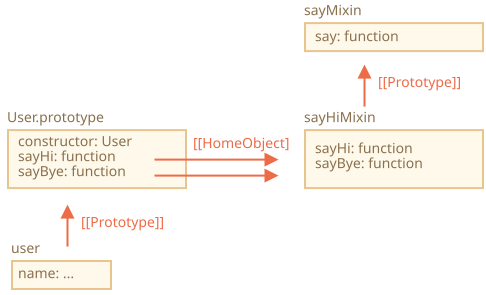

# Mixin

ใน JavaScript เราสืบทอดได้จากออบเจ็กต์เดียวเท่านั้น `[[Prototype]]` ของออบเจ็กต์มีได้แค่ตัวเดียว และคลาสก็ extend ได้แค่คลาสเดียว

แต่บางครั้งก็รู้สึกว่าไม่พอ เช่น เรามีคลาส `StreetSweeper` กับคลาส `Bicycle` แล้วอยากรวมกันเป็น `StreetSweepingBicycle`

หรือมีคลาส `User` กับคลาส `EventEmitter` ที่จัดการเรื่องอีเวนต์ แล้วอยากเอาความสามารถของ `EventEmitter` มาใส่ใน `User` เพื่อให้ผู้ใช้สามารถส่งอีเวนต์ได้

แนวคิดที่ช่วยแก้ปัญหานี้เรียกว่า "mixin"

ตามคำนิยามใน Wikipedia [mixin](https://en.wikipedia.org/wiki/Mixin) คือคลาสที่มีเมธอดให้คลาสอื่นเอาไปใช้ได้โดยไม่ต้องสืบทอด

พูดง่ายๆ ก็คือ *mixin* เตรียมเมธอดที่เพิ่มพฤติกรรมบางอย่างไว้ให้ แต่เราไม่ได้ใช้มันโดดๆ เราเอามัน "ผสม" เข้าไปในคลาสอื่นต่างหาก

## ตัวอย่างของ mixin

วิธีง่ายที่สุดในการทำ mixin ใน JavaScript คือสร้างออบเจ็กต์ที่มีเมธอดที่มีประโยชน์ แล้วค่อย merge เข้าไปในโปรโตไทป์ของคลาสไหนก็ได้

ตัวอย่างเช่น mixin ชื่อ `sayHiMixin` นี้เพิ่มความสามารถ "พูด" ให้กับ `User`:

```js run
*!*
// mixin
*/!*
let sayHiMixin = {
  sayHi() {
    alert(`Hello ${this.name}`);
  },
  sayBye() {
    alert(`Bye ${this.name}`);
  }
};

*!*
// การใช้งาน:
*/!*
class User {
  constructor(name) {
    this.name = name;
  }
}

// คัดลอกเมธอดเข้ามา
Object.assign(User.prototype, sayHiMixin);

// ตอนนี้ User พูดได้แล้ว
new User("Dude").sayHi(); // Hello Dude!
```

ไม่มีการสืบทอดเกิดขึ้น เป็นแค่การคัดลอกเมธอดธรรมดาๆ ดังนั้น `User` ยังสามารถ extend คลาสอื่นได้ แล้วค่อยเอา mixin เข้ามา "ผสม" เมธอดเพิ่มเติม แบบนี้:

```js
class User extends Person {
  // ...
}

Object.assign(User.prototype, sayHiMixin);
```

Mixin เองก็ใช้การสืบทอดระหว่างกันได้ด้วย

ตัวอย่างเช่น `sayHiMixin` สืบทอดจาก `sayMixin`:

```js run
let sayMixin = {
  say(phrase) {
    alert(phrase);
  }
};

let sayHiMixin = {
  __proto__: sayMixin, // (หรือจะใช้ Object.setPrototypeOf เพื่อกำหนดโปรโตไทป์ก็ได้)

  sayHi() {
    *!*
    // เรียกเมธอดของ parent
    */!*
    super.say(`Hello ${this.name}`); // (*)
  },
  sayBye() {
    super.say(`Bye ${this.name}`); // (*)
  }
};

class User {
  constructor(name) {
    this.name = name;
  }
}

// คัดลอกเมธอดเข้ามา
Object.assign(User.prototype, sayHiMixin);

// ตอนนี้ User พูดได้แล้ว
new User("Dude").sayHi(); // Hello Dude!
```

สังเกตว่าเมื่อเรียก `super.say()` จาก `sayHiMixin` (บรรทัดที่มี `(*)`) จะไปค้นหาเมธอดจากโปรโตไทป์ของ mixin ไม่ใช่จากคลาส

ดูแผนภาพประกอบ (ดูส่วนขวา):



ที่เป็นแบบนี้เพราะเมธอด `sayHi` กับ `sayBye` ถูกสร้างขึ้นใน `sayHiMixin` ตั้งแต่แรก ดังนั้นถึงจะคัดลอกไปแล้ว พร็อพเพอร์ตี้ภายใน `[[HomeObject]]` ก็ยังชี้ไปที่ `sayHiMixin` อยู่ดังที่เห็นในภาพ

เนื่องจาก `super` ค้นหาเมธอดของ parent จาก `[[HomeObject]].[[Prototype]]` จึงหมายความว่ามันค้นหาจาก `sayHiMixin.[[Prototype]]` นั่นเอง

## EventMixin

ทีนี้มาลองทำ mixin ที่ใช้งานจริงกันบ้าง

ฟีเจอร์สำคัญอย่างหนึ่งของออบเจ็กต์ในเบราว์เซอร์หลายตัว คือความสามารถในการสร้างอีเวนต์ อีเวนต์เป็นวิธีที่ดีในการ "กระจายข้อมูล" ไปยังทุกส่วนที่สนใจ มาลองทำ mixin ที่ช่วยเพิ่มฟังก์ชันจัดการอีเวนต์ให้กับคลาส/ออบเจ็กต์ไหนก็ได้กันเถอะ

- mixin นี้จะมีเมธอด `.trigger(name, [...data])` สำหรับ "สร้างอีเวนต์" เมื่อมีเหตุการณ์สำคัญเกิดขึ้น อาร์กิวเมนต์ `name` คือชื่อของอีเวนต์ ตามด้วยอาร์กิวเมนต์เพิ่มเติมที่เป็นข้อมูลของอีเวนต์
- เมธอด `.on(name, handler)` สำหรับเพิ่มฟังก์ชัน `handler` เป็น listener ของอีเวนต์ที่มีชื่อนั้น เมื่ออีเวนต์ `name` ถูก trigger ขึ้นมา จะเรียก handler พร้อมส่งอาร์กิวเมนต์จาก `.trigger` ให้
- ...และเมธอด `.off(name, handler)` สำหรับลบ `handler` ออก

หลังจากเพิ่ม mixin นี้เข้าไป ออบเจ็กต์ `user` จะสร้างอีเวนต์ `"login"` ได้เมื่อผู้ใช้ล็อกอิน จากนั้นออบเจ็กต์อื่น เช่น `calendar` ก็สามารถ listen อีเวนต์นี้เพื่อโหลดปฏิทินของผู้ใช้ที่ล็อกอินเข้ามา

หรือ `menu` จะสร้างอีเวนต์ `"select"` เมื่อเลือกรายการเมนู แล้วออบเจ็กต์อื่นๆ ก็กำหนด handler เพื่อตอบสนองต่ออีเวนต์นั้นได้ เป็นต้น

นี่คือโค้ด:

```js run
let eventMixin = {
  /**
   * ติดตามอีเวนต์ ตัวอย่างการใช้งาน:
   *  menu.on('select', function(item) { ... }
  */
  on(eventName, handler) {
    if (!this._eventHandlers) this._eventHandlers = {};
    if (!this._eventHandlers[eventName]) {
      this._eventHandlers[eventName] = [];
    }
    this._eventHandlers[eventName].push(handler);
  },

  /**
   * ยกเลิกการติดตาม ตัวอย่างการใช้งาน:
   *  menu.off('select', handler)
   */
  off(eventName, handler) {
    let handlers = this._eventHandlers?.[eventName];
    if (!handlers) return;
    for (let i = 0; i < handlers.length; i++) {
      if (handlers[i] === handler) {
        handlers.splice(i--, 1);
      }
    }
  },

  /**
   * สร้างอีเวนต์พร้อมชื่อและข้อมูลที่กำหนด
   *  this.trigger('select', data1, data2);
   */
  trigger(eventName, ...args) {
    if (!this._eventHandlers?.[eventName]) {
      return; // ไม่มี handler สำหรับอีเวนต์นี้
    }

    // เรียก handler ทั้งหมด
    this._eventHandlers[eventName].forEach(handler => handler.apply(this, args));
  }
};
```


- `.on(eventName, handler)` -- กำหนดฟังก์ชัน `handler` ให้ทำงานเมื่ออีเวนต์นั้นเกิดขึ้น ภายในจะมีพร็อพเพอร์ตี้ `_eventHandlers` เก็บอาร์เรย์ของ handler แยกตามชื่ออีเวนต์ แล้วเพิ่ม handler ใหม่เข้าไปในรายการ
- `.off(eventName, handler)` -- ลบฟังก์ชันออกจากรายการ handler
- `.trigger(eventName, ...args)` -- สร้างอีเวนต์ขึ้นมา โดยเรียก handler ทุกตัวจาก `_eventHandlers[eventName]` พร้อมส่งอาร์กิวเมนต์ `...args` ให้

ตัวอย่างการใช้งาน:

```js run
// สร้างคลาส
class Menu {
  choose(value) {
    this.trigger("select", value);
  }
}
// เพิ่ม mixin ที่จัดการอีเวนต์
Object.assign(Menu.prototype, eventMixin);

let menu = new Menu();

// เพิ่ม handler ที่จะทำงานเมื่อเลือกรายการ:
*!*
menu.on("select", value => alert(`Value selected: ${value}`));
*/!*

// trigger อีเวนต์ => handler ด้านบนทำงาน แสดงผลว่า:
// เลือกค่า: 123
menu.choose("123");
```

ทีนี้ถ้าต้องการให้โค้ดส่วนใดตอบสนองเมื่อมีการเลือกเมนู ก็แค่ listen ด้วย `menu.on(...)`

และ mixin `eventMixin` ช่วยให้เราเพิ่มพฤติกรรมนี้ให้กับกี่คลาสก็ได้ โดยไม่กระทบกับห่วงโซ่การสืบทอดเลย

## สรุป

*Mixin* -- เป็นคำศัพท์ทั่วไปในการเขียนโปรแกรมเชิงวัตถุ หมายถึงคลาสที่เตรียมเมธอดไว้ให้คลาสอื่นเอาไปใช้

บางภาษาอนุญาตให้สืบทอดจากหลายคลาสได้ (multiple inheritance) แต่ JavaScript ไม่รองรับ อย่างไรก็ตาม เราใช้ mixin แทนได้โดยการคัดลอกเมธอดเข้าไปในโปรโตไทป์

เราใช้ mixin เพื่อเพิ่มพฤติกรรมหลายๆ อย่างให้กับคลาสได้ เช่น การจัดการอีเวนต์อย่างที่เห็นข้างต้น

จุดที่ต้องระวังคือ mixin อาจเกิดปัญหาได้ถ้าเมธอดไปทับเมธอดเดิมของคลาสโดยไม่ได้ตั้งใจ ดังนั้นควรตั้งชื่อเมธอดของ mixin อย่างรอบคอบ เพื่อลดโอกาสที่จะซ้ำกัน
