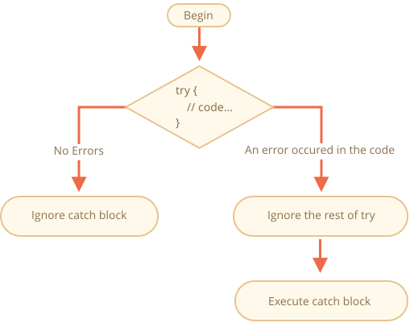

# การจัดการ error ด้วย "try...catch"

เขียนโค้ดเก่งแค่ไหน บางทีก็ยังมี error อยู่ดี — อาจเป็นเพราะเราเอง ผู้ใช้กรอกข้อมูลผิด เซิร์ฟเวอร์ตอบมาแปลกๆ หรืออีกร้อยแปดเหตุผล

ปกติพอเจอ error สคริปต์จะ "ตาย" ทันที แล้วพ่น error ออกมาที่คอนโซล

แต่ JavaScript มีท่าช่วยชีวิตอยู่ — `try...catch` ช่วยให้เรา "จับ" error ได้ แทนที่จะปล่อยให้สคริปต์ตายเฉยๆ ก็เอามาจัดการต่อได้เลย

## ไวยากรณ์ "try...catch"

เขียนง่ายๆ แค่ครอบโค้ดด้วย `try` กับ `catch`:

```js
try {

  // โค้ด...

} catch (err) {

  // จัดการ error

}
```

ทำงานยังไงล่ะ?

1. รันโค้ดใน `try {...}` ก่อน
2. ถ้าไม่มี error — ข้าม `catch` ไปเลย รันต่อข้างล่างตามปกติ
3. แต่ถ้าเกิด error — `try` หยุดทันที แล้วกระโดดไปที่ `catch (err)` แทน ตัวแปร `err` (ตั้งชื่ออะไรก็ได้) จะเก็บรายละเอียดของ error ไว้ให้



พูดง่ายๆ ก็คือ error ที่เกิดใน `try {...}` จะไม่ทำให้สคริปต์ตาย — เราจับมาจัดการได้ใน `catch`

ลองดูตัวอย่างกัน

- ตัวอย่างที่ไม่มี error: จะแสดง `alert` ที่ `(1)` กับ `(2)`:

    ```js run
    try {

      alert('Start of try runs');  // *!*(1) <--*/!*

      // ...ไม่มี error

      alert('End of try runs');   // *!*(2) <--*/!*

    } catch (err) {

      alert('Catch is ignored, because there are no errors'); // (3)

    }
    ```
- ตัวอย่างที่มี error: จะแสดง `(1)` กับ `(3)`:

    ```js run
    try {

      alert('Start of try runs');  // *!*(1) <--*/!*

    *!*
      lalala; // เกิด error เพราะตัวแปรยังไม่ได้ประกาศ!
    */!*

      alert('End of try (never reached)');  // (2)

    } catch (err) {

      alert(`Error has occurred!`); // *!*(3) <--*/!*

    }
    ```


````warn header="`try...catch` ใช้ได้กับ runtime error เท่านั้นนะ"
`try...catch` จะทำงานได้ก็ต่อเมื่อโค้ดนั้นถูกไวยากรณ์ก่อน

ถ้าโค้ดมีปัญหาเรื่องไวยากรณ์ เช่น ปีกกาไม่ครบคู่ จะจับ error ไม่ได้:

```js run
try {
  {{{{{{{{{{{{
} catch (err) {
  alert("The engine can't understand this code, it's invalid");
}
```

เพราะ JavaScript engine จะอ่านโค้ดทั้งหมดก่อนแล้วค่อยรัน ถ้าอ่านไม่ออกตั้งแต่แรก (เรียกว่า "parse-time" error) ก็จับไม่ได้เลย

`try...catch` เลยจับได้แค่ error ที่เกิดตอนรันโค้ดที่ถูกไวยากรณ์แล้วเท่านั้น — พวกนี้เรียกว่า "runtime error" หรือ "exception"
````


````warn header="`try...catch` ทำงานแบบ synchronous นะ"
มีจุดสำคัญอีกอย่าง — ถ้า error เกิดในโค้ดที่ "ตั้งเวลาไว้" เช่น `setTimeout` ตัว `try...catch` จะจับไม่ได้:

```js run
try {
  setTimeout(function() {
    noSuchVariable; // สคริปต์จะตายตรงนี้
  }, 1000);
} catch (err) {
  alert( "won't work" );
}
```

ทำไมล่ะ? ก็เพราะฟังก์ชันข้างในจะรันทีหลัง ตอนนั้น engine ผ่านพ้น `try...catch` ไปแล้ว

ทางแก้ก็คือใส่ `try...catch` ไว้ข้างในฟังก์ชันนั้นเลย:
```js run
setTimeout(function() {
  try {
    noSuchVariable; // try...catch จับ error ได้!
  } catch {
    alert( "error is caught here!" );
  }
}, 1000);
```
````

## Error object

พอเกิด error JavaScript จะสร้างออบเจ็กต์ที่บรรจุรายละเอียดไว้ให้ แล้วโยนเข้ามาใน `catch`:

```js
try {
  // ...
} catch (err) { // <-- "error object" จะตั้งชื่อเป็นอะไรก็ได้ ไม่จำเป็นต้องเป็น err
  // ...
}
```

error built-in ทุกตัวจะมีพร็อพเพอร์ตี้หลักอยู่ 2 ตัว:

`name`
: ชื่อของ error เช่น ถ้าใช้ตัวแปรที่ยังไม่ได้ประกาศ จะได้ `"ReferenceError"`

`message`
: ข้อความอธิบายรายละเอียดของ error

นอกจากนี้ยังมีอีกตัวที่ไม่ได้อยู่ในมาตรฐาน แต่เกือบทุกที่รองรับ:

`stack`
: call stack ณ ขณะนั้น เป็นสตริงที่บอกลำดับการเรียกฟังก์ชันซ้อนกันจนนำไปสู่ error นั้น ใช้ประโยชน์ในการดีบัก

ตัวอย่าง:

```js run untrusted
try {
*!*
  lalala; // เกิด error เพราะตัวแปรยังไม่ได้ประกาศ!
*/!*
} catch (err) {
  alert(err.name); // ReferenceError
  alert(err.message); // lalala is not defined
  alert(err.stack); // ReferenceError: lalala is not defined at (...call stack)

  // แสดง error ทั้งก้อนก็ได้
  // ตัว error จะถูกแปลงเป็นสตริงในรูปแบบ "name: message"
  alert(err); // ReferenceError: lalala is not defined
}
```

## ละ "catch" binding ก็ได้ (Optional "catch" binding)

[recent browser=new]

ถ้าไม่สนรายละเอียดของ error ก็ละตัวแปรได้เลย:

```js
try {
  // ...
} catch { // <-- ไม่ใส่ (err)
  // ...
}
```

## ลองใช้ "try...catch" กับงานจริง

มาดูเคสจริงๆ กันบ้าง

JavaScript มีเมธอด [JSON.parse(str)](mdn:js/JSON/parse) ที่ใช้อ่านค่า JSON เราเจอมันบ่อยมากตอนรับข้อมูลจากเซิร์ฟเวอร์

ปกติก็เรียกใช้แบบนี้:

```js run
let json = '{"name":"John", "age": 30}'; // ข้อมูลจากเซิร์ฟเวอร์

*!*
let user = JSON.parse(json); // แปลงข้อความเป็นออบเจ็กต์ JS
*/!*

// ตอนนี้ user เป็นออบเจ็กต์ที่มีพร็อพเพอร์ตี้ตามสตริงแล้ว
alert( user.name ); // John
alert( user.age );  // 30
```

อ่านเพิ่มเรื่อง JSON ได้ที่ <info:json>

**แต่ถ้า `json` มีรูปแบบผิดล่ะ? `JSON.parse` จะโยน error ออกมาแล้วสคริปต์ก็ตายเลย**

จะปล่อยแบบนี้เหรอ? ไม่ได้สิ! ผู้ใช้จะไม่รู้อะไรเลยว่าเกิดอะไรขึ้น (ยกเว้นเปิดคอนโซลดู) ไม่มีใครชอบเวลาของหายไปเฉยๆ โดยไม่บอกอะไรสักคำ

เอา `try...catch` มาช่วยเลย:

```js run
let json = "{ bad json }";

try {

*!*
  let user = JSON.parse(json); // <-- เมื่อเกิด error...
*/!*
  alert( user.name ); // ไม่ทำงาน

} catch (err) {
*!*
  // ...การทำงานจะกระโดดมาที่นี่
  alert( "Our apologies, the data has errors, we'll try to request it one more time." );
  alert( err.name );
  alert( err.message );
*/!*
}
```

ตรงนี้เราแค่แสดงข้อความ แต่จริงๆ ทำได้อีกเยอะ — ส่ง request ใหม่ เสนอทางเลือกอื่นให้ผู้ใช้ หรือส่ง error ไปเก็บ log ก็ได้ ดีกว่าปล่อยให้สคริปต์ตายเฉยๆ เป็นไหนๆ

## โยน error เองก็ได้

แต่ถ้า `json` ไวยากรณ์ถูกหมด แต่ไม่มี `name` ที่เราต้องการล่ะ?

แบบนี้:

```js run
let json = '{ "age": 30 }'; // ข้อมูลไม่ครบ

try {

  let user = JSON.parse(json); // <-- ไม่มี error
*!*
  alert( user.name ); // ไม่มี name!
*/!*

} catch (err) {
  alert( "doesn't execute" );
}
```

`JSON.parse` ไม่ได้ฟ้อง error อะไร แต่สำหรับเราแล้ว ไม่มี `name` ก็ถือว่าข้อมูลไม่ครบ — ต้องเป็น error เหมือนกัน

เราจะใช้ `throw` โยน error ออกมาเอง

### ตัวดำเนินการ "throw"

`throw` ใช้สร้าง error ขึ้นมาเอง เขียนแค่:

```js
throw <error object>
```

จริงๆ จะโยนอะไรก็ได้ ตัวเลข สตริงก็ยังได้ แต่ควรใช้ออบเจ็กต์ที่มี `name` กับ `message` จะดีกว่า — จะได้สอดคล้องกับ error ที่ JavaScript สร้างเอง

JavaScript เตรียมคอนสตรักเตอร์ error มาให้หลายตัว เช่น `Error`, `SyntaxError`, `ReferenceError`, `TypeError` เอาไปใช้สร้าง error ได้เลย:

```js
let error = new Error(message);
// หรือ
let error = new SyntaxError(message);
let error = new ReferenceError(message);
// ...
```

error built-in พวกนี้ `name` จะตรงกับชื่อคอนสตรักเตอร์เป๊ะ ส่วน `message` ก็มาจากอาร์กิวเมนต์ที่ส่งเข้าไป:

```js run
let error = new Error("Things happen o_O");

alert(error.name); // Error
alert(error.message); // Things happen o_O
```

ลองดูว่า `JSON.parse` โยน error ชนิดไหนออกมา:

```js run
try {
  JSON.parse("{ bad json o_O }");
} catch (err) {
*!*
  alert(err.name); // SyntaxError
*/!*
  alert(err.message); // Unexpected token b in JSON at position 2
}
```

เห็นไหม — เป็น `SyntaxError` เลย

ในกรณีของเราไม่มี `name` ก็ต้องถือว่า error เหมือนกัน งั้นก็ throw เลย:

```js run
let json = '{ "age": 30 }'; // ข้อมูลไม่ครบ

try {

  let user = JSON.parse(json); // <-- ไม่มี error

  if (!user.name) {
*!*
    throw new SyntaxError("Incomplete data: no name"); // (*)
*/!*
  }

  alert( user.name );

} catch (err) {
  alert( "JSON Error: " + err.message ); // JSON Error: Incomplete data: no name
}
```

บรรทัด `(*)` `throw` สร้าง `SyntaxError` พร้อม `message` ที่เรากำหนด — เหมือนกับที่ JavaScript สร้างเองเลย พอ throw ปุ๊บ `try` ก็หยุดทันทีแล้วกระโดดไป `catch`

ดูดีใช่ไหม? ตอนนี้ `catch` กลายเป็นจุดเดียวที่จัดการ error ทั้งหมด ไม่ว่าจะเป็น `JSON.parse` หรือ error ที่เราโยนเอง

## Rethrowing — โยนต่อ

แต่เดี๋ยวก่อน ถ้าใน `try {...}` เกิด *error อื่นที่เราไม่ได้คาดไว้* ล่ะ? เช่น พิมพ์ชื่อตัวแปรผิด หรือ bug อื่นๆ ที่ไม่เกี่ยวกับ "ข้อมูลไม่ถูกต้อง" เลย

ตัวอย่าง:

```js run
let json = '{ "age": 30 }'; // ข้อมูลไม่ครบ

try {
  user = JSON.parse(json); // <-- ลืมใส่ "let" หน้า user

  // ...
} catch (err) {
  alert("JSON Error: " + err); // JSON Error: ReferenceError: user is not defined
  // (จริงๆ ไม่ใช่ JSON Error เลย)
}
```

เกิดขึ้นได้แน่นอน! โปรแกรมเมอร์ก็พลาดกัน แม้แต่ไลบรารีที่คนใช้เป็นล้านก็ยังมีบั๊กโผล่ทีหลังได้

ปัญหาคือ `catch` จะจับ error *ทุกชนิด* จาก `try` ไม่เลือกหน้า เลยจับ error ที่เราไม่ได้คาดไว้มาแสดงเป็น `"JSON Error"` ซึ่งผิด แถมทำให้ดีบักยากอีก

ทางแก้คือเทคนิค "rethrowing" — หลักการง่ายมาก:

**`catch` ควรจัดการแค่ error ที่รู้จัก ที่เหลือก็โยนต่อออกไป**

ทำแบบนี้:

1. `catch` รับ error มาทุกตัว
2. ในบล็อก `catch (err) {...}` เราวิเคราะห์ออบเจ็กต์ error `err`
3. ถ้าเป็น error ที่จัดการไม่เป็น ก็ `throw err` ออกไป

ใช้ `instanceof` เช็คชนิด error ได้:

```js run
try {
  user = { /*...*/ };
} catch (err) {
*!*
  if (err instanceof ReferenceError) {
*/!*
    alert('ReferenceError'); // "ReferenceError" — เข้าถึงตัวแปรที่ยังไม่ได้ประกาศ
  }
}
```

หรือจะดูจาก `err.name` หรือ `err.constructor.name` ก็ได้

ลองดูโค้ดที่ใช้ rethrowing — `catch` จัดการแค่ `SyntaxError` ที่เหลือโยนต่อออกไป:

```js run
let json = '{ "age": 30 }'; // ข้อมูลไม่ครบ
try {

  let user = JSON.parse(json);

  if (!user.name) {
    throw new SyntaxError("Incomplete data: no name");
  }

*!*
  blabla(); // error ที่ไม่คาดคิด
*/!*

  alert( user.name );

} catch (err) {

*!*
  if (err instanceof SyntaxError) {
    alert( "JSON Error: " + err.message );
  } else {
    throw err; // โยนต่อ (*)
  }
*/!*

}
```

error ที่ throw ออกจาก `catch` ในบรรทัด `(*)` จะ "หลุด" ออกจาก `try...catch` นี้ ไปให้ `try...catch` ชั้นนอกจับ (ถ้ามี) หรือไม่ก็ทำให้สคริปต์ตาย

แบบนี้ `catch` จัดการแค่ error ที่รู้จัก ที่เหลือก็ปล่อยผ่านไป

ลองดูตัวอย่างที่มี `try...catch` ซ้อน 2 ชั้น:

```js run
function readData() {
  let json = '{ "age": 30 }';

  try {
    // ...
*!*
    blabla(); // error!
*/!*
  } catch (err) {
    // ...
    if (!(err instanceof SyntaxError)) {
*!*
      throw err; // โยนต่อ (จัดการไม่เป็น)
*/!*
    }
  }
}

try {
  readData();
} catch (err) {
*!*
  alert( "External catch got: " + err ); // caught it!
*/!*
}
```

`readData` จัดการได้แค่ `SyntaxError` — error อื่นๆ หลุดออกไปให้ `try...catch` ชั้นนอกจับแทน

## try...catch...finally

เดี๋ยวก่อน ยังมีอีกส่วนนะ — `finally`

ถ้าเพิ่ม `finally` เข้าไป บล็อกนี้จะ **รันเสมอไม่ว่าจะเกิดอะไรขึ้น**:

- หลัง `try` ถ้าไม่มี error
- หลัง `catch` ถ้ามี error

เขียนเต็มๆ เป็นแบบนี้:

```js
*!*try*/!* {
   ... try to execute the code ...
} *!*catch*/!* (err) {
   ... handle errors ...
} *!*finally*/!* {
   ... execute always ...
}
```

ลองรันโค้ดนี้ดู:

```js run
try {
  alert( 'try' );
  if (confirm('Make an error?')) BAD_CODE();
} catch (err) {
  alert( 'catch' );
} finally {
  alert( 'finally' );
}
```

โค้ดนี้มีการทำงานได้ 2 ทาง:

1. ถ้าตอบ "Yes" ที่ "จะให้เกิด error ไหม?" จะได้ `try -> catch -> finally`
2. ถ้าตอบ "No" จะได้ `try -> finally`

`finally` เหมาะมากเวลาเริ่มทำอะไรแล้วต้องปิดงานให้เรียบร้อย ไม่ว่าจะสำเร็จหรือเจ๊ง

ตัวอย่าง — จับเวลาฟังก์ชันหา Fibonacci ถ้า `fib(n)` ได้ค่าติดลบหรือไม่ใช่จำนวนเต็มก็จะ throw error แต่เราก็ยังอยากรู้ว่าใช้เวลาเท่าไหร่อยู่ดีใช่ไหม? `finally` ช่วยได้เลย:

```js run
let num = +prompt("Enter a positive integer number?", 35)

let diff, result;

function fib(n) {
  if (n < 0 || Math.trunc(n) != n) {
    throw new Error("Must not be negative, and also an integer.");
  }
  return n <= 1 ? n : fib(n - 1) + fib(n - 2);
}

let start = Date.now();

try {
  result = fib(num);
} catch (err) {
  result = 0;
*!*
} finally {
  diff = Date.now() - start;
}
*/!*

alert(result || "error occurred");

alert( `execution took ${diff}ms` );
```

ลองรันดู — ใส่ `35` ก็รันปกติ `finally` ทำงานหลัง `try` ใส่ `-1` ก็ error ทันทีแต่จับเวลาได้ถูกต้องเหมือนกัน ทั้งสองเคสผ่าน `finally` หมด

จะ `return` หรือ `throw` ก็ไม่สำคัญ — `finally` ทำงานทุกกรณี


```smart header="ตัวแปรใน `try...catch...finally` เป็นตัวแปรภายในนะ"
สังเกตว่า `result` กับ `diff` ประกาศไว้ *ข้างนอก* `try...catch`

เพราะถ้าประกาศ `let` ไว้ใน `try` จะใช้ได้แค่ข้างในบล็อกนั้นเท่านั้น
```

````smart header="`finally` กับ `return`"
แม้จะ `return` ออกจาก `try` ก็ยังเข้า `finally` ก่อนเสมอ — `finally` รันก่อนที่จะคืนค่าออกไป

```js run
function func() {

  try {
*!*
    return 1;
*/!*

  } catch (err) {
    /* ... */
  } finally {
*!*
    alert( 'finally' );
*/!*
  }
}

alert( func() ); // alert จาก finally ขึ้นก่อน แล้วค่อยถึงอันนี้
```
````

````smart header="`try...finally`"

เขียนแค่ `try...finally` โดยไม่มี `catch` ก็ได้ — ใช้ตอนที่ไม่ต้องการจัดการ error ตรงนี้ แต่ต้องการปิดงานให้เรียบร้อย

```js
function func() {
  // เริ่มทำอะไรบางอย่างที่ต้องปิดงานให้เรียบร้อย (เช่น จับเวลา)
  try {
    // ...
  } finally {
    // ปิดงานให้เรียบร้อย แม้ทุกอย่างจะพัง
  }
}
```
error ใน `try` จะหลุดออกไปเพราะไม่มี `catch` แต่ `finally` จะรันก่อนเสมอ
````

## Global catch

```warn header="ขึ้นอยู่กับสภาพแวดล้อม"
เนื้อหาในส่วนนี้ไม่ได้เป็นส่วนหนึ่งของ JavaScript หลัก
```

แล้วถ้า error เกิดข้างนอก `try...catch` ล่ะ? สคริปต์ก็ตายเลยใช่ไหม?

จริงๆ มีทางดักจับได้นะ — ถึงแม้สเปก JavaScript ไม่ได้กำหนดไว้ แต่สภาพแวดล้อมส่วนใหญ่มีให้ใช้ เช่น Node.js มี [`process.on("uncaughtException")`](https://nodejs.org/api/process.html#process_event_uncaughtexception) ส่วนในเบราว์เซอร์ก็มี [window.onerror](mdn:api/GlobalEventHandlers/onerror) ที่จะทำงานเมื่อมี error ที่ไม่ได้ถูกจับ

เขียนแบบนี้:

```js
window.onerror = function(message, url, line, col, error) {
  // ...
};
```

`message`
: ข้อความ error

`url`
: URL ของสคริปต์ที่เกิด error

`line`, `col`
: หมายเลขบรรทัดและคอลัมน์ที่เกิด error

`error`
: ออบเจ็กต์ error

ตัวอย่าง:

```html run untrusted refresh height=1
<script>
*!*
  window.onerror = function(message, url, line, col, error) {
    alert(`${message}\n At ${line}:${col} of ${url}`);
  };
*/!*

  function readData() {
    badFunc(); // อุ๊ย มีอะไรผิดพลาด!
  }

  readData();
</script>
```

`window.onerror` ไม่ได้มีไว้กู้ชีวิตสคริปต์นะ (error จากโค้ดผิดก็กู้ไม่ได้อยู่แล้ว) แต่มีไว้ส่ง error ไปให้นักพัฒนารับรู้

มีเว็บเซอร์วิสที่ช่วยเก็บ error ให้ด้วย เช่น <https://muscula.com> หรือ <https://www.sentry.io> ทำงานแบบนี้:

1. สมัครแล้วได้โค้ด JS มาแปะในเว็บ
2. โค้ดนั้นจะตั้ง `window.onerror` ให้
3. พอเกิด error ก็ส่ง request ไปเก็บไว้
4. เราเข้าไปดู error ได้ผ่านหน้าเว็บของเซอร์วิส

## สรุป

`try...catch` ช่วยให้เราจัดการ runtime error ได้ — "ลอง" รันโค้ดดู ถ้าเจ๊งก็ "จับ" error มาจัดการ

```js
try {
  // รันโค้ดนี้
} catch (err) {
  // ถ้าเกิด error ให้กระโดดมาที่นี่
  // err คือออบเจ็กต์ error
} finally {
  // รันเสมอหลังจาก try/catch
}
```

ไม่มี `catch` หรือไม่มี `finally` ก็ได้ — เขียนแค่ `try...catch` หรือ `try...finally` ก็ใช้ได้

error object มีพร็อพเพอร์ตี้หลัก:

- `message` -- ข้อความ error
- `name` -- ชื่อ error (ชื่อคอนสตรักเตอร์)
- `stack` (ไม่มาตรฐาน แต่รองรับทั่วไป) -- call stack ตอนเกิด error

ไม่สน error details ก็เขียน `catch {` ไม่ต้องมี `(err)` ได้เลย

อยากสร้าง error เอง? ใช้ `throw` ได้เลย ส่วนใหญ่จะโยนออบเจ็กต์ที่สืบทอดจาก `Error` — อ่านเพิ่มได้ในบทถัดไป

*Rethrowing* เป็นเทคนิคสำคัญมาก: `catch` จัดการแค่ error ที่รู้จัก ที่เหลือโยนต่อออกไป

ถึงไม่มี `try...catch` สภาพแวดล้อมส่วนใหญ่ก็มี global error handler ให้ใช้ ในเบราว์เซอร์ก็คือ `window.onerror`
