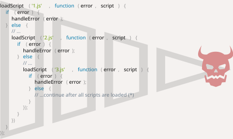

# บทนำ: callback

```warn header="ตัวอย่างในบทนี้ใช้ browser methods"
เพื่ออธิบาย callback, promise และ concept ที่เกี่ยวข้อง เราจะหยิบ browser methods มาใช้ โดยเฉพาะการโหลด script และจัดการ document เบื้องต้น

ถ้ายังไม่คุ้นเคยกับพวกนี้และอ่านแล้วงง ลองข้ามไปอ่าน [ส่วนถัดไป](/document) ของ tutorial ก่อนก็ได้

แต่เราจะพยายามอธิบายให้ชัดอยู่ดี — ไม่มีอะไรที่ซับซ้อนมากในแง่ browser
```

JavaScript host environment มีฟังก์ชันหลายตัวที่ช่วยให้เรา schedule งาน *asynchronous* ได้ — พูดง่ายๆ คือ "สั่งให้ทำ แต่ไม่ต้องรอ ทำเสร็จแล้วค่อยบอก"

ตัวอย่างที่คุ้นกันดีที่สุดคือ `setTimeout`

งาน asynchronous ในชีวิตจริงยังมีอีก เช่น การโหลด script หรือ module (จะพูดถึงในบทหลัง)

ลองดูฟังก์ชัน `loadScript(src)` ที่โหลด script จาก `src` ที่กำหนด:

```js
function loadScript(src) {
  // สร้าง tag <script> แล้วแปะไว้ในหน้า
  // พอแปะแล้ว browser จะเริ่มโหลด script ทันที และรันเมื่อโหลดเสร็จ
  let script = document.createElement('script');
  script.src = src;
  document.head.append(script);
}
```

ฟังก์ชันนี้สร้าง tag `<script src="…">` แล้วแทรกเข้าไปใน document browser จะโหลดและรัน script นั้นให้เองโดยอัตโนมัติ

เรียกใช้แบบนี้:

```js
// โหลดและรัน script จาก path ที่กำหนด
loadScript('/my/script.js');
```

ประเด็นคือ script นี้รัน "แบบ asynchronous" — เริ่มโหลดตอนนี้ แต่รันจริงทีหลัง หลังจากโค้ดที่เหลือทำงานเสร็จแล้ว

โค้ดที่เขียนหลัง `loadScript(…)` ไม่รอให้โหลดเสร็จก่อน:

```js
loadScript('/my/script.js');
// โค้ดที่อยู่ต่อจาก loadScript
// ไม่รอให้ script โหลดเสร็จ
// ...
```

สมมติเราอยากใช้ฟังก์ชันใน script ที่โหลดมา ทันทีที่มันโหลดเสร็จ

แต่ถ้าเรียกมันต่อจาก `loadScript(…)` เลย มันจะเจ๊ง:

```js
loadScript('/my/script.js'); // ใน script มี "function newFunction() {…}"

*!*
newFunction(); // ไม่มีฟังก์ชันนี้!
*/!*
```

เหตุผลก็ชัดเจน — browser ยังโหลดไม่เสร็จเลย ตอนนี้ `loadScript` ยังไม่มีทางบอกเราได้ว่า "โหลดเสร็จแล้วนะ" script จะโหลดเสร็จแล้วรัน แค่นั้น แต่เราไม่รู้ว่า "เมื่อไหร่" — เลยเรียกฟังก์ชันใน script นั้นไม่ได้

แก้ได้ด้วยการเพิ่ม `callback` เป็นอาร์กิวเมนต์ตัวที่สองของ `loadScript` ฟังก์ชันนี้จะรันหลัง script โหลดเสร็จ:

```js
function loadScript(src, *!*callback*/!*) {
  let script = document.createElement('script');
  script.src = src;

*!*
  script.onload = () => callback(script);
*/!*

  document.head.append(script);
}
```

อีเวนต์ `onload` อธิบายไว้ในบทความ <info:onload-onerror#loading-a-script> — โดยย่อคือมันจะเรียกฟังก์ชันหลัง script โหลดและรันเสร็จ

ทีนี้ถ้าอยากเรียกฟังก์ชันจาก script ที่โหลดมา ก็เขียนไว้ใน callback:

```js
loadScript('/my/script.js', function() {
  // callback รันหลัง script โหลดเสร็จ
  newFunction(); // ตอนนี้ใช้ได้แล้ว
  ...
});
```

พูดง่ายๆ คือ อาร์กิวเมนต์ตัวที่สองเป็นฟังก์ชัน (มักเป็น anonymous function) ที่จะรันเมื่อ action นั้นทำเสร็จ

ลองดูตัวอย่างที่รันได้จริงกับ script จริงๆ:

```js run
function loadScript(src, callback) {
  let script = document.createElement('script');
  script.src = src;
  script.onload = () => callback(script);
  document.head.append(script);
}

*!*
loadScript('https://cdnjs.cloudflare.com/ajax/libs/lodash.js/3.2.0/lodash.js', script => {
  alert(`เยี่ยม! script ${script.src} โหลดเสร็จแล้ว`);
  alert( _ ); // _ คือฟังก์ชันที่ประกาศไว้ใน script ที่เพิ่งโหลดมา
});
*/!*
```

ท่านี้เรียกว่า "callback-based" style — ฟังก์ชันที่ทำงาน asynchronous จะรับ `callback` เป็นอาร์กิวเมนต์ไว้ เพื่อเรียกตอนทำเสร็จ

เราใช้แนวทางนี้กับ `loadScript` แต่จริงๆ เป็น pattern ทั่วไปที่ใช้กันในหลายที่มากๆ

## Callback ซ้อน callback

จะโหลด script สองตัวตามลำดับยังไงล่ะ? ตัวแรกก่อน แล้วค่อยโหลดตัวที่สอง

วิธีที่ตรงไปตรงมาคือเอา `loadScript` ตัวที่สองไปใส่ไว้ใน callback ของตัวแรก:

```js
loadScript('/my/script.js', function(script) {

  alert(`เยี่ยม! ${script.src} โหลดเสร็จแล้ว โหลดอีกตัวนึงเลย`);

*!*
  loadScript('/my/script2.js', function(script) {
    alert(`เยี่ยม! script ตัวที่สองโหลดเสร็จแล้ว`);
  });
*/!*

});
```

พอ `loadScript` ตัวนอกทำเสร็จ callback ก็จะเรียก `loadScript` ตัวใน

แล้วถ้าต้องการโหลด script ตัวที่สามด้วยล่ะ...?

```js
loadScript('/my/script.js', function(script) {

  loadScript('/my/script2.js', function(script) {

*!*
    loadScript('/my/script3.js', function(script) {
      // ...ทำต่อหลังจากทุก script โหลดเสร็จ
    });
*/!*

  });

});
```

action ใหม่ทุกอันก็ต้องซ้อนเข้าไปใน callback ถ้ามีแค่ 2-3 อันก็ยังพอไหว แต่ถ้าเยอะกว่านี้จะเริ่มมีปัญหา — เดี๋ยวจะเห็นกัน

## จัดการ error

ตัวอย่างที่ผ่านมาไม่ได้คิดเรื่อง error เลย ถ้า script โหลดไม่ขึ้นล่ะ? callback ต้องรับมือกับกรณีนี้ได้ด้วย

นี่คือ `loadScript` เวอร์ชันที่จัดการ error ด้วย:

```js
function loadScript(src, callback) {
  let script = document.createElement('script');
  script.src = src;

*!*
  script.onload = () => callback(null, script);
  script.onerror = () => callback(new Error(`Script load error for ${src}`));
*/!*

  document.head.append(script);
}
```

โหลดสำเร็จก็เรียก `callback(null, script)` โหลดเจ๊งก็เรียก `callback(error)`

การใช้งาน:
```js
loadScript('/my/script.js', function(error, script) {
  if (error) {
    // จัดการ error
  } else {
    // script โหลดสำเร็จ
  }
});
```

pattern นี้ใช้กันบ่อยมากจนมีชื่อเรียกว่า "error-first callback"

กฎก็คือ:
1. อาร์กิวเมนต์ตัวแรกของ `callback` สงวนไว้สำหรับ error — ถ้ามีปัญหาก็เรียก `callback(err)`
2. อาร์กิวเมนต์ตัวที่สอง (และตัวถัดๆ ไปถ้ามี) ไว้สำหรับผลลัพธ์เมื่อสำเร็จ — เรียก `callback(null, result1, result2…)`

`callback` ตัวเดียวเลยทำหน้าที่ได้ทั้งรายงาน error และส่งผลลัพธ์กลับ

## Pyramid of Doom

มองแวบแรก callback-based style ดูเป็นแนวทางที่ใช้ได้ — และก็ใช้ได้จริงถ้ามีแค่ 1-2 ชั้น

แต่พอมี async action หลายอันต่อกัน โค้ดจะหน้าตาแบบนี้:

```js
loadScript('1.js', function(error, script) {

  if (error) {
    handleError(error);
  } else {
    // ...
    loadScript('2.js', function(error, script) {
      if (error) {
        handleError(error);
      } else {
        // ...
        loadScript('3.js', function(error, script) {
          if (error) {
            handleError(error);
          } else {
  *!*
            // ...ทำต่อหลังจากทุก script โหลดเสร็จ (*)
  */!*
          }
        });

      }
    });
  }
});
```

ไล่ดูโค้ดข้างบน:
1. โหลด `1.js` ถ้าไม่มี error...
2. โหลด `2.js` ถ้าไม่มี error...
3. โหลด `3.js` ถ้าไม่มี error — ค่อยทำอย่างอื่น `(*)`

ยิ่ง callback ซ้อนกันเยอะ โค้ดก็ยิ่งลึกและจัดการยาก โดยเฉพาะถ้าแทน `...` ด้วยโค้ดจริงๆ ที่มีทั้ง loop, if/else ต่างๆ

นี่แหละที่เรียกว่า "callback hell" หรือ "pyramid of doom"

<!--
loadScript('1.js', function(error, script) {
  if (error) {
    handleError(error);
  } else {
    // ...
    loadScript('2.js', function(error, script) {
      if (error) {
        handleError(error);
      } else {
        // ...
        loadScript('3.js', function(error, script) {
          if (error) {
            handleError(error);
          } else {
            // ...
          }
        });
      }
    });
  }
});
-->



"พีระมิด" ของ callback ที่ซ้อนกันจะขยายออกทางขวาเรื่อยๆ ทุกครั้งที่มี async action เพิ่ม — ไม่นานก็เอาไม่อยู่

วิธีนี้เลยไม่ดีนัก

เราพอแก้ได้นิดหน่อยด้วยการแยกแต่ละ action ออกเป็นฟังก์ชัน top-level แบบนี้:

```js
loadScript('1.js', step1);

function step1(error, script) {
  if (error) {
    handleError(error);
  } else {
    // ...
    loadScript('2.js', step2);
  }
}

function step2(error, script) {
  if (error) {
    handleError(error);
  } else {
    // ...
    loadScript('3.js', step3);
  }
}

function step3(error, script) {
  if (error) {
    handleError(error);
  } else {
    // ...ทำต่อหลังจากทุก script โหลดเสร็จ (*)
  }
}
```

เห็นไหม? ทำได้เหมือนกัน และไม่ซ้อนลึกแล้ว เพราะแยกแต่ละ action เป็นฟังก์ชันของตัวเอง

แต่ก็มีปัญหา — โค้ดมันดูเหมือน spreadsheet ที่ถูกฉีกทิ้ง อ่านยาก ตาต้องกระโดดไปมาระหว่างฟังก์ชัน ยิ่งถ้าคนอ่านไม่คุ้นกับโค้ดนี้มาก่อน ยิ่งงงหนัก

แถมฟังก์ชัน `step*` พวกนี้ใช้ครั้งเดียวทิ้ง สร้างขึ้นมาเพื่อหนี "pyramid of doom" โดยเฉพาะ ไม่มีใครเอาไปใช้ที่อื่นอีก — namespace ก็เลยรก

เราอยากได้วิธีที่ดีกว่านี้

โชคดีที่มีทางเลือกอื่น วิธีที่ดีที่สุดวิธีหนึ่งคือการใช้ promise ซึ่งจะพูดถึงในบทถัดไป
