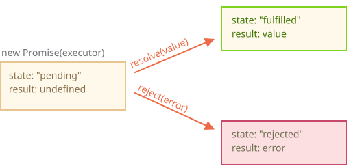

# Promise

สมมติว่าเราเป็นนักร้องชื่อดัง แล้วแฟนๆ ทวงเพลงใหม่กันทั้งวันทั้งคืน

แทนที่จะให้ทุกคนมารุมถามตลอด เราบอกว่า "ได้เลย พอเพลงออก จะส่งให้ทันที" แล้วแจกฟอร์มให้แฟนๆ กรอกอีเมลไว้ พอเพลงพร้อม — ทุกคนที่ลงชื่อจะได้รับพร้อมกัน

ถ้าเกิดเหตุสุดวิสัยอย่างไฟไหม้สตูดิโอจนออกเพลงไม่ได้ ก็จะแจ้งให้รู้เช่นกัน

ทุกคนพอใจ — แฟนๆ ไม่พลาดเพลง เราก็ไม่โดนรุมถาม

เรื่องนี้คล้ายกับสิ่งที่เราเจอบ่อยในโปรแกรมมิ่ง:

1. **"producing code"** คือโค้ดที่ทำงานบางอย่างและใช้เวลา เช่น โหลดข้อมูลจากเน็ต — นั่นคือ "นักร้อง"
2. **"consuming code"** คือโค้ดที่ต้องการผลลัพธ์จาก producing code ตอนที่พร้อมแล้ว จะมีหลายฟังก์ชันก็ได้ที่รออยู่ — นั่นคือ "แฟนๆ"
3. ***promise*** คือออบเจ็กต์ JavaScript พิเศษที่เชื่อม producing code กับ consuming code เข้าหากัน — นั่นคือ "รายชื่อผู้ติดตาม" นั่นเอง

    producing code ใช้เวลาเท่าไรก็ได้เพื่อทำงานให้เสร็จ แล้ว promise จะส่งผลลัพธ์ไปให้ทุกโค้ดที่รออยู่พร้อมกัน

การเปรียบเทียบนี้ไม่ได้ตรงแบบ 100% เพราะ promise ใน JavaScript ทำได้มากกว่าแค่รายชื่อผู้ติดตาม แต่ใช้เป็นภาพตั้งต้นก็พอ

เขียน promise แบบนี้:

```js
let promise = new Promise(function(resolve, reject) {
  // executor (producing code, "นักร้อง")
});
```

ฟังก์ชันที่ส่งให้ `new Promise` เรียกว่า *executor* พอสร้าง `new Promise` ขึ้นมา executor จะรันทันทีเลย — มันคือโค้ดที่จะทำงานจนได้ผลลัพธ์ออกมา เปรียบได้กับ "นักร้อง" นั่นเอง

พารามิเตอร์ `resolve` และ `reject` คือคอลแบ็กที่ JavaScript เตรียมให้เราเอง เราไม่ต้องสร้างเอง แค่เรียกใช้

พอ executor ทำงานเสร็จ ไม่ว่าจะเร็วหรือช้า ให้เรียกอันใดอันหนึ่ง:

- `resolve(value)` — ถ้าทำสำเร็จ โดย `value` คือผลลัพธ์
- `reject(error)` — ถ้าเกิด error โดย `error` คือออบเจ็กต์ error

สรุปง่ายๆ คือ executor รันอัตโนมัติแล้วพยายามทำงาน พอเสร็จก็เรียก `resolve` ถ้าสำเร็จ หรือ `reject` ถ้าพัง

ออบเจ็กต์ `promise` ที่ได้จาก `new Promise` มีพร็อพเพอร์ตี้ภายในดังนี้:

- `state` — เริ่มต้นเป็น `"pending"` จากนั้นเปลี่ยนเป็น `"fulfilled"` เมื่อเรียก `resolve` หรือ `"rejected"` เมื่อเรียก `reject`
- `result` — เริ่มต้นเป็น `undefined` จากนั้นเปลี่ยนเป็น `value` เมื่อเรียก `resolve(value)` หรือ `error` เมื่อเรียก `reject(error)`

executor จะพา promise ไปสู่สถานะใดสถานะหนึ่งในที่สุด:



แฟนๆ จะ subscribe การเปลี่ยนแปลงพวกนี้ยังไงล่ะ? เดี๋ยวดูกัน

ลองดูตัวอย่าง promise ที่มี producing code ซึ่งใช้เวลา (ผ่าน `setTimeout`):

```js
let promise = new Promise(function(resolve, reject) {
  // ฟังก์ชันนี้รันอัตโนมัติตอนสร้าง promise

  // หลัง 1 วินาที แจ้งว่าทำเสร็จแล้ว พร้อมผลลัพธ์ "done"
  setTimeout(() => *!*resolve("done")*/!*, 1000);
});
```

รันโค้ดด้านบนแล้วจะเห็น 2 อย่าง:

1. `new Promise` เรียก executor ทันทีโดยอัตโนมัติ
2. executor ได้รับ 2 อาร์กิวเมนต์ คือ `resolve` และ `reject` ซึ่ง JavaScript engine เตรียมไว้ให้แล้ว ไม่ต้องสร้างเอง แค่เรียกอันใดอันหนึ่งตอนพร้อม

    หลัง "ประมวลผล" ไป 1 วินาที executor เรียก `resolve("done")` เพื่อส่งผลลัพธ์ สถานะของ `promise` เปลี่ยนเป็น:

    

นั่นคือตัวอย่างที่ทำสำเร็จ — "fulfilled promise"

ทีนี้ดูตัวอย่างที่ executor reject promise ด้วย error:

```js
let promise = new Promise(function(resolve, reject) {
  // หลัง 1 วินาที แจ้งว่าเกิด error
  setTimeout(() => *!*reject(new Error("Whoops!"))*/!*, 1000);
});
```

การเรียก `reject(...)` จะพา promise ไปสู่สถานะ `"rejected"`:


สรุปแล้ว executor ทำงานบางอย่าง (มักใช้เวลา) จากนั้นเรียก `resolve` หรือ `reject` เพื่อเปลี่ยนสถานะของ promise

promise ที่ resolve หรือ reject ไปแล้วเรียกว่า "settled" — ต่างจากตอนแรกที่ยัง "pending" อยู่

````smart header="ได้แค่ผลลัพธ์เดียวหรือ error เดียวเท่านั้น"
executor ควรเรียก `resolve` หรือ `reject` แค่ครั้งเดียว การเปลี่ยนสถานะจะเกิดขึ้นครั้งเดียวแล้วจบ

การเรียก `resolve` และ `reject` ครั้งต่อๆ ไปจะถูกเพิกเฉย:

```js
let promise = new Promise(function(resolve, reject) {
*!*
  resolve("done");
*/!*

  reject(new Error("…")); // ถูกเพิกเฉย
  setTimeout(() => resolve("…")); // ถูกเพิกเฉย
});
```

ก็เพราะงานที่ executor ทำนั้นมีได้แค่ผลลัพธ์เดียวหรือ error เดียวเท่านั้น

แถม `resolve`/`reject` รับแค่อาร์กิวเมนต์เดียว (หรือไม่รับเลยก็ได้) อาร์กิวเมนต์เพิ่มเติมจะถูกเพิกเฉย
````

```smart header="Reject ด้วย Error objects"
ถ้าเกิดอะไรผิดพลาด executor ควรเรียก `reject` โดยส่งอาร์กิวเมนต์ประเภทไหนก็ได้ (เหมือนกับ `resolve`) แต่แนะนำให้ใช้ออบเจ็กต์ `Error` (หรือออบเจ็กต์ที่ inherit จาก `Error`) เหตุผลจะชัดขึ้นในภายหลัง
```

````smart header="เรียก `resolve`/`reject` ได้ทันทีเลย"
จริงๆ แล้ว executor มักทำงาน asynchronous แล้วค่อยเรียก `resolve`/`reject` ทีหลัง แต่ก็ไม่จำเป็นต้องรอ เรียกทันทีเลยก็ได้ แบบนี้:

```js
let promise = new Promise(function(resolve, reject) {
  // ไม่รอเลย resolve ทันที
  resolve(123); // ส่งผลลัพธ์ทันที: 123
});
```

เช่น กรณีที่เริ่มทำงานแล้วพบว่าทุกอย่าง cache ไว้แล้ว resolve ทันทีก็ได้เลย

promise ก็จะ resolved ทันที
````

```smart header="`state` และ `result` เป็นพร็อพเพอร์ตี้ภายใน"
พร็อพเพอร์ตี้ `state` และ `result` ของออบเจ็กต์ Promise เป็นพร็อพเพอร์ตี้ภายใน เข้าถึงตรงๆ ไม่ได้ ต้องใช้เมธอด `.then`/`.catch`/`.finally` แทน ซึ่งจะอธิบายด้านล่าง
```

## Consumers: then, catch

ทำงานเสร็จแล้ว — แฟนๆ รับผลได้ยังไง?

ฟังก์ชันที่รอรับผลลัพธ์หรือ error เรียกว่า consuming functions ลงทะเบียน (subscribe) ผ่านเมธอด `.then` และ `.catch` ได้เลย

### then

`.then` คือเมธอดที่สำคัญที่สุด

เขียนแบบนี้:

```js
promise.then(
  function(result) { *!*/* จัดการกรณีสำเร็จ */*/!* },
  function(error) { *!*/* จัดการกรณี error */*/!* }
);
```

อาร์กิวเมนต์แรกของ `.then` คือฟังก์ชันที่รันเมื่อ promise resolved และรับผลลัพธ์มา

อาร์กิวเมนต์ที่สองคือฟังก์ชันที่รันเมื่อ promise rejected และรับ error มา

ตัวอย่างเมื่อ promise resolved สำเร็จ:

```js run
let promise = new Promise(function(resolve, reject) {
  setTimeout(() => resolve("done!"), 1000);
});

// resolve จะรันฟังก์ชันแรกใน .then
promise.then(
*!*
  result => alert(result), // แสดง "done!" หลัง 1 วินาที
*/!*
  error => alert(error) // ไม่รัน
);
```

ฟังก์ชันแรกทำงาน

ส่วนกรณี rejection จะรันฟังก์ชันที่สอง:

```js run
let promise = new Promise(function(resolve, reject) {
  setTimeout(() => reject(new Error("Whoops!")), 1000);
});

// reject จะรันฟังก์ชันที่สองใน .then
promise.then(
  result => alert(result), // ไม่รัน
*!*
  error => alert(error) // แสดง "Error: Whoops!" หลัง 1 วินาที
*/!*
);
```

ถ้าสนใจแค่กรณีสำเร็จ ส่งแค่ฟังก์ชันเดียวเป็นอาร์กิวเมนต์ได้เลย:

```js run
let promise = new Promise(resolve => {
  setTimeout(() => resolve("done!"), 1000);
});

*!*
promise.then(alert); // แสดง "done!" หลัง 1 วินาที
*/!*
```

### catch

ถ้าสนใจแค่ error อย่างเดียว ใช้ `null` เป็นอาร์กิวเมนต์แรกได้: `.then(null, errorHandlingFunction)` หรือจะใช้ `.catch(errorHandlingFunction)` ก็เหมือนกัน:


```js run
let promise = new Promise((resolve, reject) => {
  setTimeout(() => reject(new Error("Whoops!")), 1000);
});

*!*
// .catch(f) เหมือนกับ promise.then(null, f)
promise.catch(alert); // แสดง "Error: Whoops!" หลัง 1 วินาที
*/!*
```

`.catch(f)` เป็นแค่ shorthand ของ `.then(null, f)` นั่นเอง

## Cleanup: finally

เหมือนกับที่มี `finally` ใน `try {...} catch {...}` promise ก็มี `finally` เช่นกัน

`.finally(f)` คล้ายกับ `.then(f, f)` ตรงที่ `f` จะรันเสมอ ไม่ว่า promise จะ settled แบบ resolve หรือ reject

ไว้ใช้ทำ cleanup หลังจากงานเสร็จ ไม่ว่าจะสำเร็จหรือพัง

ตัวอย่างเช่น — หยุด loading indicator ปิด connection ที่ไม่ใช้แล้ว ฯลฯ

นึกภาพว่าเหมือนคนที่มาเก็บงานปาร์ตี้ ไม่ว่าปาร์ตี้จะสนุกหรือเงียบเหงาแค่ไหน ก็ต้องเก็บกวาดทุกครั้ง

โค้ดหน้าตาแบบนี้:

```js
new Promise((resolve, reject) => {
  /* ทำงานบางอย่างที่ใช้เวลา แล้วเรียก resolve หรือ reject */
})
*!*
  // รันเมื่อ promise settled ไม่สนว่าสำเร็จหรือพัง
  .finally(() => หยุด loading indicator)
  // loading indicator จะหยุดก่อนเสมอ แล้วค่อยไปต่อ
*/!*
  .then(result => แสดงผลลัพธ์, err => แสดง error)
```

แต่ `finally(f)` ไม่ได้เหมือน `then(f,f)` ซะทีเดียว มีข้อแตกต่างสำคัญ:

1. `finally` handler ไม่รับอาร์กิวเมนต์ เพราะตอนที่อยู่ใน `finally` เราไม่รู้ว่า promise สำเร็จหรือพัง ก็โอเค เพราะงานของ `finally` คือทำ "cleanup ทั่วไป"

    ดูตัวอย่างด้านบน จะเห็นว่า `finally` handler ไม่มีอาร์กิวเมนต์ และผลลัพธ์ของ promise จะผ่านไปถึง handler ตัวถัดไปเอง
2. `finally` handler "ส่งต่อ" ผลลัพธ์หรือ error ไปให้ handler ตัวถัดไปที่เหมาะสม

    เช่น ผลลัพธ์จะผ่าน `finally` ไปถึง `then` โดยตรง:

    ```js run
    new Promise((resolve, reject) => {
      setTimeout(() => resolve("value"), 2000);
    })
      .finally(() => alert("Promise ready")) // รันก่อน
      .then(result => alert(result)); // <-- .then แสดง "value"
    ```

    จะเห็นว่า `value` จาก promise แรกผ่าน `finally` ไปถึง `then` ได้เลย

    สะดวกมาก เพราะ `finally` ไม่ได้ไว้ประมวลผลลัพธ์ของ promise อยู่แล้ว — เป็นที่สำหรับ cleanup ทั่วๆ ไป ไม่ว่าผลจะออกมายังไง

    ตัวอย่าง error ที่ผ่าน `finally` ไปถึง `catch`:

    ```js run
    new Promise((resolve, reject) => {
      throw new Error("error");
    })
      .finally(() => alert("Promise ready")) // รันก่อน
      .catch(err => alert(err));  // <-- .catch แสดง error
    ```

3. `finally` handler ไม่ควร return อะไร ถ้า return ค่าที่ return ออกมาจะถูกเพิกเฉยเงียบๆ

    ยกเว้นกรณีเดียวคือถ้า `finally` handler throw error — error นั้นจะส่งต่อไปให้ handler ถัดไปแทน

สรุป:

- `finally` handler ไม่รับผลลัพธ์จาก handler ก่อนหน้า (ไม่มีอาร์กิวเมนต์) แต่ผลลัพธ์นั้นจะผ่านไปถึง handler ที่เหมาะสมตัวถัดไปเอง
- ถ้า `finally` return อะไร ค่านั้นจะถูกเพิกเฉย
- ถ้า `finally` throw error จะไปถึง error handler ที่ใกล้ที่สุด

พอใช้ `finally` ตามวัตถุประสงค์ — คือ cleanup ทั่วไป — ฟีเจอร์พวกนี้ก็จะเข้ากันได้พอดีเลย

````smart header="ใส่ handler กับ settled promise ได้"
ถ้า promise ยัง pending อยู่ handler ของ `.then/catch/finally` จะรอจนกว่าผลลัพธ์จะออกมา

แต่บางครั้ง promise อาจ settled แล้วตอนที่เราใส่ handler เข้าไป

ในกรณีนั้น handler จะรันทันทีเลย:

```js run
// promise resolved ทันทีตอนสร้าง
let promise = new Promise(resolve => resolve("done!"));

promise.then(alert); // done! (แสดงทันที)
```

ต่างจากชีวิตจริงที่ถ้านักร้อง release เพลงไปแล้วแล้วมีคนมาสมัครหลัง ก็คงไม่ได้รับเพลงนั้น แต่ promise ยืดหยุ่นกว่า — ใส่ handler เมื่อไรก็ได้ ถ้าผลลัพธ์มีแล้ว handler จะรันทันที
````

## ตัวอย่าง: loadScript [#loadscript]

มาดูตัวอย่างจริงๆ ว่า promise ช่วยเขียนโค้ด asynchronous ได้ยังไง

เราใช้ฟังก์ชัน `loadScript` สำหรับโหลด script จากบทที่แล้ว

แบบเดิมที่ใช้ callback ดูอีกทีก่อน:

```js
function loadScript(src, callback) {
  let script = document.createElement('script');
  script.src = src;

  script.onload = () => callback(null, script);
  script.onerror = () => callback(new Error(`Script load error for ${src}`));

  document.head.append(script);
}
```

ทีนี้เขียนใหม่ด้วย Promise:

ฟังก์ชัน `loadScript` แบบใหม่ไม่ต้องการ callback แล้ว แต่จะสร้างและคืน Promise object ที่ resolve เมื่อโหลดเสร็จ โค้ดภายนอกใส่ handler ผ่าน `.then` ได้เลย:

```js run
function loadScript(src) {
  return new Promise(function(resolve, reject) {
    let script = document.createElement('script');
    script.src = src;

    script.onload = () => resolve(script);
    script.onerror = () => reject(new Error(`Script load error for ${src}`));

    document.head.append(script);
  });
}
```

การใช้งาน:

```js run
let promise = loadScript("https://cdnjs.cloudflare.com/ajax/libs/lodash.js/4.17.11/lodash.js");

promise.then(
  script => alert(`${script.src} is loaded!`),
  error => alert(`Error: ${error.message}`)
);

promise.then(script => alert('Another handler...'));
```

เห็นข้อดีเมื่อเทียบกับแบบ callback ได้ชัดเลย:

| Promise | Callback |
|----------|-----------|
| Promise ให้เราทำตามลำดับที่เป็นธรรมชาติ — รัน `loadScript(script)` ก่อน แล้วค่อย `.then` บอกว่าจะทำอะไรกับผลลัพธ์ | ต้องมีฟังก์ชัน `callback` พร้อมก่อนเรียก `loadScript(script, callback)` พูดง่ายๆ คือต้องรู้ล่วงหน้าว่าจะทำอะไรกับผลลัพธ์ก่อนเรียกฟังก์ชัน |
| เรียก `.then` บน Promise กี่ครั้งก็ได้ แต่ละครั้งก็เหมือนเพิ่ม "แฟน" คนใหม่เข้าใน "รายชื่อผู้ติดตาม" อ่านเพิ่มเติมใน <info:promise-chaining> | มี callback ได้แค่อันเดียว |

Promise ให้ code flow ที่ดีกว่าและยืดหยุ่นกว่า ยังมีอีกมาก จะดูกันในบทต่อๆ ไป
