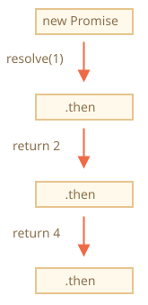
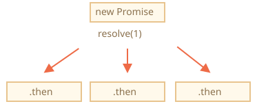
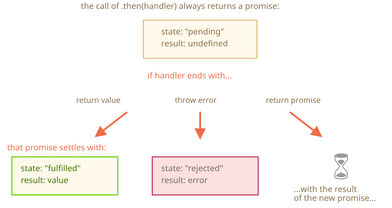

# Promise Chaining

ย้อนกลับไปที่ปัญหาที่เราเจอใน <info:callbacks> กัน — ถ้าต้องรันงาน async หลายอย่างต่อกันเป็นลำดับ เช่น โหลด script ทีละไฟล์ เราจะจัดการยังไงให้โค้ดไม่พัง?

promise มีท่าให้ใช้พอดี

บทนี้เราจะคุยกันเรื่อง promise chaining โดยเฉพาะ

หน้าตาประมาณนี้:

```js run
new Promise(function(resolve, reject) {

  setTimeout(() => resolve(1), 1000); // (*)

}).then(function(result) { // (**)

  alert(result); // 1
  return result * 2;

}).then(function(result) { // (***)

  alert(result); // 2
  return result * 2;

}).then(function(result) {

  alert(result); // 4
  return result * 2;

});
```

หลักก็คือ — ค่าผลลัพธ์จะวิ่งต่อไปเรื่อยๆ ตลอด chain ของ `.then`

ลำดับการทำงาน:
1. promise ตัวแรก resolve หลังจาก 1 วินาที `(*)`
2. จากนั้น `.then` handler ก็ทำงาน `(**)` แล้วคืนค่า promise ใหม่ (resolve ด้วยค่า `2`)
3. `.then` ตัวถัดไป `(***)` รับค่าจากตัวก่อน แล้วส่งต่อให้ handler ถัดไปอีก
4. ...ไปเรื่อยๆ แบบนี้

ผลที่ได้คือ `alert` จะแสดงตามลำดับ: `1` -> `2` -> `4`



ที่ทำแบบนี้ได้เพราะ `.then` ทุกครั้งคืนค่าเป็น promise ใหม่เสมอ ทำให้เราต่อ `.then` ถัดไปต่อกันเป็นสายได้

พอ handler คืนค่าอะไรออกมา ค่านั้นก็กลายเป็นผลลัพธ์ของ promise ตัวนั้น แล้ว `.then` ถัดไปก็รับค่านั้นไปทำต่อ

**ข้อผิดพลาดยอดฮิตของมือใหม่: ต่อ `.then` หลายตัวเข้ากับ promise เดียวกัน — อันนี้ไม่ใช่ chaining นะ**

ตัวอย่าง:
```js run
let promise = new Promise(function(resolve, reject) {
  setTimeout(() => resolve(1), 1000);
});

promise.then(function(result) {
  alert(result); // 1
  return result * 2;
});

promise.then(function(result) {
  alert(result); // 1
  return result * 2;
});

promise.then(function(result) {
  alert(result); // 1
  return result * 2;
});
```

สิ่งที่เราทำที่นี่คือแค่ผูก handler หลายตัวเข้ากับ promise เดียว แต่ละตัวไม่ได้รับค่าต่อจากกัน ต่างคนต่างทำงานแยก

ดูภาพเปรียบเทียบ (ต่างจาก chaining ด้านบนชัดเลย):



`.then` ทุกตัวที่ผูกกับ promise เดียวกันจะได้ค่าเดิมหมด — ก็คือค่าที่ promise ตัวนั้น resolve มา โค้ดด้านบนเลย `alert` แสดง `1` ทุกตัว

ในทางปฏิบัติเราแทบไม่ค่อยต้องการ handler หลายตัวต่อ promise เดียวหรอก ใช้ chaining บ่อยกว่าเยอะ

## คืนค่าเป็น Promise

handler ใน `.then(handler)` คืนค่าเป็น promise ได้เช่นกัน

ถ้าทำแบบนั้น handler ตัวถัดไปจะรอจนกว่า promise นั้นจะ settle ก่อน แล้วค่อยรับผลลัพธ์

ดูตัวอย่าง:

```js run
new Promise(function(resolve, reject) {

  setTimeout(() => resolve(1), 1000);

}).then(function(result) {

  alert(result); // 1

*!*
  return new Promise((resolve, reject) => { // (*)
    setTimeout(() => resolve(result * 2), 1000);
  });
*/!*

}).then(function(result) { // (**)

  alert(result); // 2

  return new Promise((resolve, reject) => {
    setTimeout(() => resolve(result * 2), 1000);
  });

}).then(function(result) {

  alert(result); // 4

});
```

`.then` ตัวแรก alert แสดง `1` แล้วคืนค่า `new Promise(…)` ในบรรทัด `(*)` หลังจาก 1 วินาที promise นั้น resolve ค่า `result * 2` ก็ถูกส่งไปให้ handler ของ `.then` ตัวที่สอง

handler นั้นอยู่ที่บรรทัด `(**)` แสดง `2` แล้วก็ทำแบบเดียวกัน

ผลลัพธ์เหมือนตัวอย่างก่อนเลย: 1 -> 2 -> 4 แต่คราวนี้มีดีเลย์ 1 วินาทีระหว่างแต่ละ `alert`

การคืนค่าเป็น promise แบบนี้ทำให้เราสร้าง chain ของงาน async ได้นั่นเอง

## ตัวอย่าง: loadScript

ลองใช้ฟีเจอร์นี้กับ `loadScript` ที่แปลงเป็น promise ไว้แล้วใน[บทก่อน](info:promise-basics#loadscript) เพื่อโหลด script ทีละไฟล์ตามลำดับ:

```js run
loadScript("/article/promise-chaining/one.js")
  .then(function(script) {
    return loadScript("/article/promise-chaining/two.js");
  })
  .then(function(script) {
    return loadScript("/article/promise-chaining/three.js");
  })
  .then(function(script) {
    // ใช้ฟังก์ชันที่ประกาศไว้ใน script
    // เพื่อพิสูจน์ว่าโหลดสำเร็จจริงๆ
    one();
    two();
    three();
  });
```

เขียนสั้นลงได้อีกด้วย arrow function:

```js run
loadScript("/article/promise-chaining/one.js")
  .then(script => loadScript("/article/promise-chaining/two.js"))
  .then(script => loadScript("/article/promise-chaining/three.js"))
  .then(script => {
    // script ทุกไฟล์โหลดแล้ว เรียกใช้ฟังก์ชันได้เลย
    one();
    two();
    three();
  });
```

แต่ละ `loadScript` คืนค่าเป็น promise พอ promise resolve `.then` ถัดไปก็ทำงาน แล้วก็เริ่มโหลด script ไฟล์ต่อไป script เลยโหลดทีละไฟล์ตามลำดับ

เราเพิ่มงาน async เข้า chain ได้เรื่อยๆ สังเกตว่าโค้ดยัง "แบน" อยู่ — ยาวลงข้างล่าง ไม่โตไปทางขวา ไม่มีกลิ่น "pyramid of doom" เลย

แต่ถ้าอยากเขียน `.then` แบบ nested ก็ทำได้นะ:

```js run
loadScript("/article/promise-chaining/one.js").then(script1 => {
  loadScript("/article/promise-chaining/two.js").then(script2 => {
    loadScript("/article/promise-chaining/three.js").then(script3 => {
      // ฟังก์ชันนี้เข้าถึงตัวแปร script1, script2, script3 ได้ทั้งหมด
      one();
      two();
      three();
    });
  });
});
```

โค้ดนี้ทำงานเหมือนกัน: โหลด 3 script ตามลำดับ แต่มันโตไปทางขวา กลับมามีปัญหาเดิมเหมือน callback เลย

คนที่เพิ่งเริ่มใช้ promise บางทีไม่รู้ว่ามี chaining เลยเขียนแบบ nested แทน โดยทั่วไปการ chain ดีกว่า

แต่ก็มีบางกรณีที่เขียน `.then` แบบ nested โอเคนะ เพราะฟังก์ชันด้านในเข้าถึง scope ด้านนอกได้

จากตัวอย่างด้านบน callback ที่ nested ลึกสุดเข้าถึง `script1`, `script2`, `script3` ได้ครบ — แต่นี่เป็นข้อยกเว้น ไม่ใช่กฎ

````smart header="Thenables"
จริงๆ แล้ว handler ไม่จำเป็นต้องคืนค่าเป็น promise ก็ได้ — คืนเป็น "thenable" object ก็พอ นั่นคือออบเจ็กต์ที่มีเมธอด `.then` JavaScript จะปฏิบัติกับมันเหมือน promise เลย

แนวคิดคือ library ของคนอื่นอาจ implement "promise-compatible" object ของตัวเอง ซึ่งมีเมธอดเพิ่มเติมได้ แต่ยังใช้งานร่วมกับ promise มาตรฐานได้ เพราะ implement `.then` ไว้

ดูตัวอย่าง thenable object:

```js run
class Thenable {
  constructor(num) {
    this.num = num;
  }
  then(resolve, reject) {
    alert(resolve); // function() { native code }
    // resolve ด้วย this.num*2 หลังจาก 1 วินาที
    setTimeout(() => resolve(this.num * 2), 1000); // (**)
  }
}

new Promise(resolve => resolve(1))
  .then(result => {
*!*
    return new Thenable(result); // (*)
*/!*
  })
  .then(alert); // แสดง 2 หลังจาก 1000ms
```

JavaScript เช็คออบเจ็กต์ที่ handler คืนมาในบรรทัด `(*)`: ถ้ามีเมธอด `then` ที่เรียกได้ ก็จะเรียกเมธอดนั้นโดยส่ง native `resolve` และ `reject` เป็น argument (เหมือน executor) แล้วรอจนกว่าจะมีการเรียกหนึ่งในนั้น

จากตัวอย่าง `resolve(2)` ถูกเรียกหลัง 1 วินาที `(**)` แล้วค่าก็ถูกส่งต่อลง chain

ฟีเจอร์นี้ทำให้เราผสาน custom object เข้ากับ promise chain ได้ โดยไม่ต้องสืบทอด (inherit) จาก `Promise` เลย
````


## ตัวอย่างใหญ่: fetch

ใน frontend เราใช้ promise กับ network request กันบ่อยมาก ลองดูตัวอย่างที่เจาะลึกขึ้นกัน

เราจะใช้เมธอด [fetch](info:fetch) ดึงข้อมูล user จาก server มา พารามิเตอร์เสริมมีเยอะ (ดูใน[บทที่แยกออกมา](info:fetch)) แต่รูปแบบพื้นฐานง่ายมาก:

```js
let promise = fetch(url);
```

แค่นี้ก็ส่ง network request ไปที่ `url` แล้วคืนค่าเป็น promise

promise นั้นจะ resolve ด้วย `response` object เมื่อ server ตอบกลับมาพร้อม header — แต่ยังไม่ได้ดาวน์โหลดข้อมูลทั้งหมดนะ

ถ้าต้องการอ่านข้อมูลทั้งหมด ต้องเรียก `response.text()`: ซึ่งคืนค่าเป็น promise ที่จะ resolve เมื่อดาวน์โหลด text ครบแล้ว

โค้ดนี้ request ไปที่ `user.json` แล้วโหลด text จาก server:

```js run
fetch('/article/promise-chaining/user.json')
  // .then ด้านล่างทำงานเมื่อ server ตอบกลับ
  .then(function(response) {
    // response.text() คืนค่าเป็น promise ใหม่ที่ resolve ด้วย text ทั้งหมด
    // เมื่อโหลดเสร็จ
    return response.text();
  })
  .then(function(text) {
    // ...นี่คือเนื้อหาของไฟล์บน server
    alert(text); // {"name": "iliakan", "isAdmin": true}
  });
```

`response` object ที่ได้จาก `fetch` มีเมธอด `response.json()` ด้วย — อ่านข้อมูลแล้ว parse เป็น JSON ให้เลย ในกรณีนี้สะดวกกว่า ลองเปลี่ยนไปใช้แทน

ใช้ arrow function ให้กระชับขึ้นด้วย:

```js run
// เหมือนด้านบน แต่ response.json() parse เป็น JSON ให้เลย
fetch('/article/promise-chaining/user.json')
  .then(response => response.json())
  .then(user => alert(user.name)); // iliakan, ได้ชื่อ user แล้ว
```

ทีนี้ลองทำอะไรกับ user ที่โหลดมาดูบ้าง

เช่น ส่ง request อีกอันไปที่ GitHub โหลดโปรไฟล์ user แล้วแสดงรูป avatar:

```js run
// Request user.json
fetch('/article/promise-chaining/user.json')
  // โหลดเป็น json
  .then(response => response.json())
  // Request ไปที่ GitHub
  .then(user => fetch(`https://api.github.com/users/${user.name}`))
  // โหลด response เป็น json
  .then(response => response.json())
  // แสดงรูป avatar (githubUser.avatar_url) นาน 3 วินาที (อาจเพิ่ม animation ด้วย)
  .then(githubUser => {
    let img = document.createElement('img');
    img.src = githubUser.avatar_url;
    img.className = "promise-avatar-example";
    document.body.append(img);

    setTimeout(() => img.remove(), 3000); // (*)
  });
```

โค้ดทำงานได้ ดูคอมเมนต์สำหรับรายละเอียด แต่มีจุดพลาดแอบซ่อนอยู่ — เป็นกับดักยอดฮิตของคนที่เพิ่งหัดใช้ promise

ดูบรรทัด `(*)` สิ: ถ้าอยากทำอะไรสักอย่าง *หลังจาก* รูป avatar แสดงครบแล้วและถูกลบออกไป จะทำได้ยังไง? เช่น อยากแสดง form แก้ไขข้อมูล user ตอนนี้ยังไม่มีทางทำได้เลย

ถ้าต้องการให้ chain ต่อได้ ต้องคืนค่าเป็น promise ที่ resolve ตอนที่ avatar แสดงครบแล้ว

แบบนี้:

```js run
fetch('/article/promise-chaining/user.json')
  .then(response => response.json())
  .then(user => fetch(`https://api.github.com/users/${user.name}`))
  .then(response => response.json())
*!*
  .then(githubUser => new Promise(function(resolve, reject) { // (*)
*/!*
    let img = document.createElement('img');
    img.src = githubUser.avatar_url;
    img.className = "promise-avatar-example";
    document.body.append(img);

    setTimeout(() => {
      img.remove();
*!*
      resolve(githubUser); // (**)
*/!*
    }, 3000);
  }))
  // ทำงานหลังจาก 3 วินาที
  .then(githubUser => alert(`Finished showing ${githubUser.name}`));
```

`.then` handler ในบรรทัด `(*)` คืนค่า `new Promise` ซึ่งจะ settled ก็ต่อเมื่อ `resolve(githubUser)` ใน `setTimeout` ถูกเรียกที่บรรทัด `(**)`

`.then` ถัดไปใน chain จะรอก่อนเสมอ

แนวปฏิบัติที่ดีคือ งาน async ควรคืนค่าเป็น promise เสมอ ทำให้เราวางแผนงานต่อไปได้ แม้ตอนนี้ยังไม่ได้ต่อ chain แต่ก็อาจต้องการภายหลัง

สุดท้าย แยกโค้ดออกเป็นฟังก์ชันที่นำกลับมาใช้ได้:

```js run
function loadJson(url) {
  return fetch(url)
    .then(response => response.json());
}

function loadGithubUser(name) {
  return loadJson(`https://api.github.com/users/${name}`);
}

function showAvatar(githubUser) {
  return new Promise(function(resolve, reject) {
    let img = document.createElement('img');
    img.src = githubUser.avatar_url;
    img.className = "promise-avatar-example";
    document.body.append(img);

    setTimeout(() => {
      img.remove();
      resolve(githubUser);
    }, 3000);
  });
}

// ใช้งาน:
loadJson('/article/promise-chaining/user.json')
  .then(user => loadGithubUser(user.name))
  .then(showAvatar)
  .then(githubUser => alert(`Finished showing ${githubUser.name}`));
  // ...
```

## สรุป

ถ้า handler ใน `.then` (หรือ `catch/finally` ก็ตาม) คืนค่าเป็น promise ส่วนที่เหลือของ chain จะรอจนกว่ามันจะ settle แล้วค่อยรับผลลัพธ์ (หรือ error) ไปทำต่อ

ดูภาพรวมทั้งหมดได้ที่นี่:


