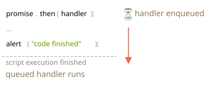

# Microtasks

handler ของ Promise อย่าง `.then`/`.catch`/`.finally` นั้น asynchronous เสมอ

แม้ promise จะ resolve ทันทีตั้งแต่ต้น โค้ดที่อยู่ *ใต้* `.then`/`.catch`/`.finally` ก็ยังรันก่อน handler เสมอ

ลองดูตัวอย่างนี้:

```js run
let promise = Promise.resolve();

promise.then(() => alert("promise done!"));

alert("code finished"); // alert นี้โผล่ขึ้นมาก่อน
```

รันแล้วจะเห็น `code finished` ขึ้นมาก่อน แล้วค่อยตามมาด้วย `promise done!`

แปลกดีใช่ไหม? ก็ promise นี้ resolve ไปแล้วตั้งแต่แรกนี่

แล้วทำไม `.then` ถึงยังรอก่อน? เกิดอะไรขึ้นล่ะ?

## คิวของ Microtask

งาน asynchronous ต้องการระบบจัดการที่ดีพอ มาตรฐาน ECMA จึงกำหนดให้มีคิว internal ชื่อ `PromiseJobs`

คนส่วนใหญ่เรียกกันสั้นๆ ว่า "microtask queue" — คำที่ใช้กันใน V8

ตาม [specification](https://tc39.github.io/ecma262/#sec-jobs-and-job-queues) บอกไว้ว่า:

- คิวเป็นแบบ first-in-first-out: งานที่เข้าคิวก่อนก็รันก่อน
- งานชิ้นหนึ่งจะเริ่มรันได้ก็ต่อเมื่อไม่มีอะไรกำลังรันอยู่

พูดง่ายๆ คือ พอ promise พร้อมแล้ว handler `.then/catch/finally` จะโดนโยนเข้าคิว — ยังไม่รันทันที

รอจนกว่า JavaScript engine จะว่างจากโค้ดปัจจุบันก่อน แล้วถึงค่อยดึงงานจากคิวมารัน

เลยเป็นเหตุผลว่าทำไม "code finished" ถึงโผล่ขึ้นมาก่อนในตัวอย่างข้างบน



handler ของ promise ทุกตัวต้องผ่านคิว internal นี้เสมอ

ถ้ามี chain ที่ต่อ `.then/catch/finally` หลายตัว แต่ละตัวก็รัน asynchronous เหมือนกัน

เข้าคิวก่อน แล้วรอจนโค้ดปัจจุบันเสร็จและ handler ก่อนหน้ารันครบแล้วค่อยรัน

**แล้วถ้าเราต้องการให้ลำดับถูกต้องล่ะ? จะให้ `code finished` ขึ้นหลัง `promise done` ได้ยังไง?**

ง่ายมาก — โยนเข้าคิวด้วย `.then` เลย:

```js run
Promise.resolve()
  .then(() => alert("promise done!"))
  .then(() => alert("code finished"));
```

ได้ลำดับตามที่ต้องการเลย

## Unhandled rejection

ยังจำ event `unhandledrejection` จากบทความ <info:promise-error-handling> ได้ไหม?

ทีนี้เราเข้าใจแล้วว่า JavaScript รู้ได้ยังไงว่ามี rejection ที่ไม่มีใครจัดการ

**"unhandled rejection" เกิดขึ้นเมื่อ error ใน promise ไม่ถูกจัดการก่อนที่คิว microtask จะหมด**

ปกติถ้าเราคาดว่าจะมี error ก็แค่ต่อ `.catch` เข้าไปใน promise chain:

```js run
let promise = Promise.reject(new Error("Promise Failed!"));
*!*
promise.catch(err => alert('caught'));
*/!*

// ไม่รัน: error ถูกจัดการแล้ว
window.addEventListener('unhandledrejection', event => alert(event.reason));
```

แต่ถ้าลืมต่อ `.catch` เอาไว้ พอคิว microtask ว่าง engine จะยิง event นั้นขึ้นมา:

```js run
let promise = Promise.reject(new Error("Promise Failed!"));

// Promise Failed!
window.addEventListener('unhandledrejection', event => alert(event.reason));
```

แล้วถ้าเราจัดการ error ทีหลังล่ะ? แบบนี้:

```js run
let promise = Promise.reject(new Error("Promise Failed!"));
*!*
setTimeout(() => promise.catch(err => alert('caught')), 1000);
*/!*

// Error: Promise Failed!
window.addEventListener('unhandledrejection', event => alert(event.reason));
```

รันแล้วจะเห็น `Promise Failed!` ขึ้นก่อน แล้วค่อยตามด้วย `caught`

ถ้าไม่รู้เรื่องคิว microtask ก็คงงงว่า "ทำไม `unhandledrejection` ถึงยิง? เราจัดการ error แล้วนี่!"

แต่ตอนนี้เราเข้าใจแล้ว — `unhandledrejection` จะยิงขึ้นมาตอนที่คิว microtask ว่างหมด

engine จะสแกน promise ทั้งหมด ถ้าเจออันไหนยังอยู่ในสถานะ "rejected" ก็ยิง event ทันที

ในตัวอย่างข้างบน `.catch` ที่ใส่ผ่าน `setTimeout` ก็รันได้นะ — แต่รันทีหลัง ตอน `unhandledrejection` เกิดขึ้นไปแล้ว เลยไม่เปลี่ยนอะไรทั้งนั้น

## สรุป

การจัดการ promise นั้น asynchronous เสมอ — ทุก action ของ promise ต้องผ่านคิว internal "promise jobs" หรือที่เรียกว่า "microtask queue" (คำของ V8)

เลยแปลว่า handler `.then/catch/finally` จะรันหลังจากโค้ดปัจจุบันเสร็จสิ้นเสมอ

ถ้าต้องการให้โค้ดบางส่วนรันหลัง `.then/catch/finally` แน่นอน ก็ต่อ `.then` เพิ่มเข้าไปใน chain ได้เลย

ใน JavaScript engine ส่วนใหญ่ ทั้งเบราว์เซอร์และ Node.js แนวคิดของ microtask ผูกติดกับ "event loop" และ "macrotasks" อย่างแนบแน่น แต่เรื่องพวกนั้นไม่ได้เกี่ยวกับ promise โดยตรง เราไปคุยกันต่อในบทความ <info:event-loop>
