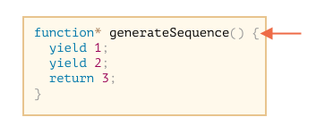
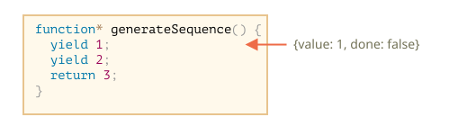
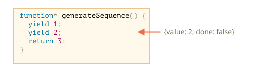
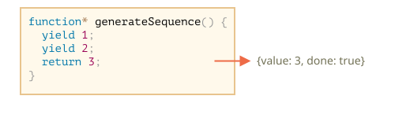
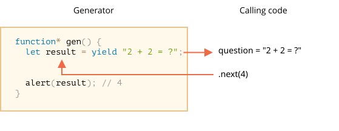
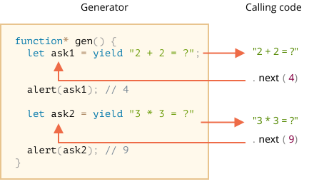

# Generators

ฟังก์ชันปกติจะคืนค่าได้แค่ค่าเดียว (หรือไม่คืนค่าเลย)

Generator ต่างออกไป — "yield" ค่าออกมาได้หลายค่า ทีละตัว ตามจังหวะที่เราขอ ทำงานร่วมกับ [iterable](info:iterable) ได้ดีมาก เหมาะกับการสร้าง data stream

## Generator functions

จะสร้าง generator ต้องใช้ syntax พิเศษ คือ `function*` หรือที่เรียกว่า "generator function"

เขียนแบบนี้:

```js
function* generateSequence() {
  yield 1;
  yield 2;
  return 3;
}
```

Generator function ทำงานต่างจากฟังก์ชันปกติเยอะ — เวลาเรียก จะยังไม่รันโค้ดข้างในทันที แต่คืนออบเจ็กต์พิเศษที่เรียกว่า "generator object" ออกมาก่อน

ลองดู:

```js run
function* generateSequence() {
  yield 1;
  yield 2;
  return 3;
}

// "generator function" สร้าง "generator object"
let generator = generateSequence();
*!*
alert(generator); // [object Generator]
*/!*
```

โค้ดในฟังก์ชันยังไม่ได้รันเลย:



เมธอดหลักของ generator คือ `next()` — พอเรียก จะรันโค้ดจนถึง `yield <value>` ตัวที่ใกล้ที่สุด (ถ้าไม่ระบุ `value` จะได้ `undefined`) แล้วหยุดรอตรงนั้น พร้อมส่งค่าที่ yield ออกมาให้โค้ดข้างนอก

ผลลัพธ์ของ `next()` จะเป็นออบเจ็กต์ที่มีสองพร็อพเพอร์ตี้เสมอ:
- `value`: ค่าที่ yield ออกมา
- `done`: `true` ถ้าโค้ดในฟังก์ชันทำงานเสร็จแล้ว, ถ้ายังไม่เสร็จจะเป็น `false`

ลองสร้าง generator แล้วดึงค่าแรกออกมา:

```js run
function* generateSequence() {
  yield 1;
  yield 2;
  return 3;
}

let generator = generateSequence();

*!*
let one = generator.next();
*/!*

alert(JSON.stringify(one)); // {value: 1, done: false}
```

ได้ค่าแรกมาแล้ว ตอนนี้ generator หยุดพักอยู่ที่บรรทัดที่สอง:



เรียก `generator.next()` อีกครั้ง จะรันต่อจากจุดที่ค้างไว้แล้ว yield ค่าถัดไปออกมา:

```js
let two = generator.next();

alert(JSON.stringify(two)); // {value: 2, done: false}
```



เรียกครั้งที่สาม วิ่งไปถึง `return` แล้วจบงาน:

```js
let three = generator.next();

alert(JSON.stringify(three)); // {value: 3, *!*done: true*/!*}
```



ตอนนี้ generator ทำงานเสร็จแล้ว ดูได้จาก `done: true` และค่า `value: 3` คือผลลัพธ์สุดท้าย

เรียก `generator.next()` ต่อไปอีกก็ไม่มีประโยชน์แล้ว — จะได้ `{done: true}` กลับมาตลอด

```smart header="`function* f(…)` หรือ `function *f(…)`?"
ทั้งสอง syntax ใช้ได้ทั้งคู่

แต่ส่วนใหญ่นิยม syntax แรก เพราะดาว `*` บอกว่าเป็น generator function — มันบอก "ชนิด" ของฟังก์ชัน ไม่ใช่ชื่อ จึงควรติดกับ keyword `function` ไว้
```

## Generators are iterable

พอดูที่เมธอด `next()` ก็คงเดาออกแล้วว่า generator นั้น [iterable](info:iterable) นั่นเอง

วนลูปด้วย `for..of` ได้เลย:

```js run
function* generateSequence() {
  yield 1;
  yield 2;
  return 3;
}

let generator = generateSequence();

for(let value of generator) {
  alert(value); // 1 แล้วก็ 2
}
```

อ่านง่ายกว่าเรียก `.next().value` ตลอดเวลาใช่ไหม?

...แต่สังเกตว่า ตัวอย่างนี้แสดงแค่ `1` แล้วก็ `2` เท่านั้น ไม่มี `3` เลย!

เพราะ `for..of` จะข้ามค่าสุดท้ายที่มี `done: true` ถ้าต้องการให้แสดงค่าทั้งหมด ต้องใช้ `yield` แทน `return`:

```js run
function* generateSequence() {
  yield 1;
  yield 2;
*!*
  yield 3;
*/!*
}

let generator = generateSequence();

for(let value of generator) {
  alert(value); // 1 แล้วก็ 2 แล้วก็ 3
}
```

พอ generator เป็น iterable ฟีเจอร์ที่ใช้กับ iterable ได้ก็ใช้ได้หมด เช่น spread syntax `...`:

```js run
function* generateSequence() {
  yield 1;
  yield 2;
  yield 3;
}

let sequence = [0, ...generateSequence()];

alert(sequence); // 0, 1, 2, 3
```

ในโค้ดด้านบน `...generateSequence()` แปลง generator object ที่เป็น iterable ให้กลายเป็นอาร์เรย์ (อ่านเพิ่มเติมเรื่อง spread syntax ได้ที่ [](info:rest-parameters-spread#spread-syntax))

## Using generators for iterables

เมื่อก่อนในบท [](info:iterable) เราเคยสร้างออบเจ็กต์ `range` ที่ iterable ได้ โดยคืนค่าตั้งแต่ `from` ถึง `to`

นี่คือโค้ดเดิม:

```js run
let range = {
  from: 1,
  to: 5,

  // for..of range เรียกเมธอดนี้แค่ครั้งเดียวตอนเริ่ม
  [Symbol.iterator]() {
    // ...มันคืนค่าเป็น iterator object:
    // จากนั้น for..of จะทำงานกับออบเจ็กต์นั้น โดยเรียกขอค่าถัดไปเรื่อยๆ
    return {
      current: this.from,
      last: this.to,

      // next() ถูกเรียกในแต่ละรอบของ for..of loop
      next() {
        // ต้องคืนค่าในรูปแบบออบเจ็กต์ {done:.., value :...}
        if (this.current <= this.last) {
          return { done: false, value: this.current++ };
        } else {
          return { done: true };
        }
      }
    };
  }
};

// การวนลูปผ่าน range คืนค่าตัวเลขตั้งแต่ range.from ถึง range.to
alert([...range]); // 1,2,3,4,5
```

ใส่ generator function เป็น `Symbol.iterator` ได้เลย

นี่คือ `range` แบบเดิม แต่กระชับขึ้นมากๆ:

```js run
let range = {
  from: 1,
  to: 5,

  *[Symbol.iterator]() { // ย่อมาจาก [Symbol.iterator]: function*()
    for(let value = this.from; value <= this.to; value++) {
      yield value;
    }
  }
};

alert( [...range] ); // 1,2,3,4,5
```

ทำงานได้เพราะ `range[Symbol.iterator]()` ตอนนี้คืนค่าเป็น generator และ generator มีสิ่งที่ `for..of` ต้องการพอดี:
- มีเมธอด `.next()`
- ที่คืนค่าในรูปแบบ `{value: ..., done: true/false}`

ไม่ใช่เรื่องบังเอิญเลย — JavaScript เพิ่ม generator เข้ามาพร้อมกับ iterator ตั้งแต่แรก ออกแบบมาให้ทำงานเข้าคู่กันได้ง่ายๆ

โค้ดแบบ generator กระชับกว่าโค้ด iterable เดิมมาก แต่ยังทำงานได้เหมือนกันทุกอย่าง

```smart header="Generator สร้างค่าได้ไม่รู้จบ"
ตัวอย่างข้างต้นสร้างลำดับจำนวนจำกัด แต่เราสร้าง generator ที่ yield ค่าตลอดไปก็ได้ เช่น ลำดับตัวเลขสุ่มที่ไม่มีที่สิ้นสุด

แบบนั้นต้องมี `break` (หรือ `return`) ใน `for..of` ไม่งั้น loop จะวนไม่หยุดแล้วค้างแน่นอน
```

## Generator composition

ทีนี้มาเจอท่าเด็ดของ generator — "ฝัง" generator ตัวหนึ่งเข้าไปใน generator อีกตัวได้แบบเนียนๆ ไม่ต้องเขียนโค้ดเชื่อมยุ่งยาก เรียกว่า generator composition

ลองนึกว่าเรามีฟังก์ชันสร้างลำดับตัวเลข:

```js
function* generateSequence(start, end) {
  for (let i = start; i <= end; i++) yield i;
}
```

ทีนี้อยากนำมาต่อกันให้ได้ลำดับที่ซับซ้อนขึ้น:
- ตัวเลข `0..9` (character codes 48..57)
- ตามด้วยตัวอักษรใหญ่ `A..Z` (character codes 65..90)
- ตามด้วยตัวอักษรเล็ก `a..z` (character codes 97..122)

ลำดับนี้เอาไปสร้างรหัสผ่านได้ (เพิ่ม syntax characters ก็ได้) แต่ขอสร้างลำดับก่อนเลย

ในฟังก์ชันปกติ ถ้าจะรวมผลลัพธ์จากหลายฟังก์ชัน ก็ต้องเรียกทีละตัว เก็บผลลัพธ์ไว้ แล้วรวมกันตอนท้าย

สำหรับ generator มี syntax พิเศษ `yield*` ที่ใช้ "ฝัง" (compose) generator เข้ากัน

ลองดู composed generator:

```js run
function* generateSequence(start, end) {
  for (let i = start; i <= end; i++) yield i;
}

function* generatePasswordCodes() {

*!*
  // 0..9
  yield* generateSequence(48, 57);

  // A..Z
  yield* generateSequence(65, 90);

  // a..z
  yield* generateSequence(97, 122);
*/!*

}

let str = '';

for(let code of generatePasswordCodes()) {
  str += String.fromCharCode(code);
}

alert(str); // 0..9A..Za..z
```

`yield*` คือคำสั่ง *มอบหมาย* การทำงานให้ generator อื่น — `yield* gen` จะวนผ่าน generator `gen` แล้วส่งต่อค่าที่ yield ออกมาราวกับว่า generator ตัวนอกเป็นคนส่งเอง

ผลลัพธ์เหมือนกับเขียนโค้ดของ generator ที่ซ้อนอยู่ข้างในตรงๆ เลย:

```js run
function* generateSequence(start, end) {
  for (let i = start; i <= end; i++) yield i;
}

function* generateAlphaNum() {

*!*
  // yield* generateSequence(48, 57);
  for (let i = 48; i <= 57; i++) yield i;

  // yield* generateSequence(65, 90);
  for (let i = 65; i <= 90; i++) yield i;

  // yield* generateSequence(97, 122);
  for (let i = 97; i <= 122; i++) yield i;
*/!*

}

let str = '';

for(let code of generateAlphaNum()) {
  str += String.fromCharCode(code);
}

alert(str); // 0..9A..Za..z
```

Generator composition ช่วยส่งต่อ flow จาก generator หนึ่งเข้าอีกตัวได้แบบลื่นๆ ไม่ต้องเก็บผลลัพธ์กลางทางให้เปลืองหน่วยความจำด้วย

## "yield" เป็นถนนสองทาง

ถึงตรงนี้ generator ยังดูคล้าย iterable object ทั่วไปแค่มี syntax เก๋ๆ สำหรับสร้างค่า... แต่จริงๆ แล้วทำได้มากกว่านั้นเยอะ

เพราะ `yield` เป็นถนนสองทาง — ไม่ได้ส่งค่าออกข้างนอกอย่างเดียว แต่รับค่ากลับเข้า generator ก็ได้ด้วย

ทำได้โดยเรียก `generator.next(arg)` พร้อมส่งอาร์กิวเมนต์เข้าไป อาร์กิวเมนต์นั้นจะกลายเป็นผลลัพธ์ของ `yield`

ดูตัวอย่าง:

```js run
function* gen() {
*!*
  // ส่งคำถามออกไปให้โค้ดข้างนอก แล้วรอคำตอบ
  let result = yield "2 + 2 = ?"; // (*)
*/!*

  alert(result);
}

let generator = gen();

let question = generator.next().value; // <-- yield คืนค่าออกมา

generator.next(4); // --> ส่งผลลัพธ์กลับเข้าไปใน generator  
```



1. การเรียก `generator.next()` ครั้งแรกควรเรียกโดยไม่มีอาร์กิวเมนต์ (ถ้าส่งไปก็ไม่มีผล) มันเริ่มรันโค้ดและคืนค่าของ `yield "2+2=?"` ออกมา จากนั้น generator หยุดรออยู่ที่บรรทัด `(*)`
2. ผลลัพธ์ของ `yield` ไปอยู่ในตัวแปร `question` ในโค้ดที่เรียก
3. พอเรียก `generator.next(4)` generator ทำงานต่อ และ `4` กลายเป็นผลลัพธ์: `let result = 4`

โค้ดข้างนอกไม่จำเป็นต้องเรียก `next(4)` ทันทีนะ — อาจใช้เวลาคิดก่อนก็ได้ generator รอได้เรื่อยๆ

ตัวอย่างเช่น:

```js
// ค่อยส่งค่ากลับเข้า generator ทีหลัง
setTimeout(() => generator.next(4), 1000);
```

จะเห็นว่าต่างจากฟังก์ชันปกติตรงที่ generator กับโค้ดที่เรียกใช้สามารถแลกเปลี่ยนข้อมูลกันผ่าน `next/yield` ได้

มาดูตัวอย่างที่ชัดขึ้นกว่านี้ โดยมีการเรียกหลายรอบ:

```js run
function* gen() {
  let ask1 = yield "2 + 2 = ?";

  alert(ask1); // 4

  let ask2 = yield "3 * 3 = ?"

  alert(ask2); // 9
}

let generator = gen();

alert( generator.next().value ); // "2 + 2 = ?"

alert( generator.next(4).value ); // "3 * 3 = ?"

alert( generator.next(9).done ); // true
```

ภาพการทำงาน:



1. `.next()` ครั้งแรกเริ่มรันโค้ด... แล้วไปถึง `yield` ตัวแรก
2. ผลลัพธ์คืนออกไปให้โค้ดข้างนอก
3. `.next(4)` ส่ง `4` กลับเข้า generator เป็นผลลัพธ์ของ `yield` ตัวแรก แล้วรันต่อ
4. ...ไปถึง `yield` ตัวที่สอง ซึ่งกลายเป็นผลลัพธ์ที่ส่งออกไป
5. `next(9)` ส่ง `9` เข้า generator เป็นผลลัพธ์ของ `yield` ตัวที่สอง รันต่อจนจบฟังก์ชัน ได้ `done: true`

เหมือนเกม "ปิงปอง" เลย — แต่ละ `next(value)` (ยกเว้นครั้งแรก) ส่งค่าเข้า generator กลายเป็นผลลัพธ์ของ `yield` ปัจจุบัน แล้วรับค่าจาก `yield` ถัดไปกลับออกมา

## generator.throw

จากตัวอย่างที่ผ่านมา โค้ดข้างนอกส่งค่าเข้า generator ได้ผ่าน `yield`

แต่ก็โยน error เข้าไปได้เช่นกัน — เพราะ error ก็เป็นรูปแบบหนึ่งของผลลัพธ์นั่นเอง

ใช้ `generator.throw(err)` เพื่อโยน error เข้าไป ซึ่ง `err` จะเกิดขึ้นในบรรทัดที่มี `yield` นั้นๆ

ตัวอย่างเช่น `yield "2 + 2 = ?"` นำไปสู่ error:

```js run
function* gen() {
  try {
    let result = yield "2 + 2 = ?"; // (1)

    alert("The execution does not reach here, because the exception is thrown above");
  } catch(e) {
    alert(e); // แสดง error
  }
}

let generator = gen();

let question = generator.next().value;

*!*
generator.throw(new Error("The answer is not found in my database")); // (2)
*/!*
```

Error ที่โยนเข้า generator ที่บรรทัด `(2)` ทำให้เกิด exception ที่บรรทัด `(1)` ตรงที่มี `yield` ตัวอย่างนี้ `try..catch` จับได้และแสดงออกมา

ถ้าไม่จับ error ไว้ มันก็จะหลุดออกจาก generator ไปยังโค้ดที่เรียกตามปกติ

โค้ดข้างนอกตอนนี้อยู่ที่บรรทัด `generator.throw` (บรรทัด `(2)`) เราก็จับ error ตรงจุดนั้นได้เลยแบบนี้:

```js run
function* generate() {
  let result = yield "2 + 2 = ?"; // Error ที่บรรทัดนี้
}

let generator = generate();

let question = generator.next().value;

*!*
try {
  generator.throw(new Error("The answer is not found in my database"));
} catch(e) {
  alert(e); // แสดง error
}
*/!*
```

ถ้าไม่จับ error ตรงนั้น มันก็จะผ่านขึ้นไปยังโค้ดที่เรียกชั้นถัดไป (ถ้ามี) และถ้าไม่มีใครจับ script ก็จะพัง

## generator.return

`generator.return(value)` สั่งให้ generator หยุดทำงานทันที แล้วคืนค่าที่ระบุออกมา

```js
function* gen() {
  yield 1;
  yield 2;
  yield 3;
}

const g = gen();

g.next();        // { value: 1, done: false }
g.return('foo'); // { value: "foo", done: true }
g.next();        // { value: undefined, done: true }
```

ถ้าเรียก `generator.return()` กับ generator ที่จบไปแล้ว มันจะคืนค่านั้นซ้ำอีกครั้ง ([MDN](https://developer.mozilla.org/en-US/docs/Web/JavaScript/Reference/Global_Objects/Generator/return))

ส่วนใหญ่ไม่ค่อยได้ใช้ เพราะปกติเราอยากดึงค่าทั้งหมดออกมา แต่มีประโยชน์เวลาต้องการหยุด generator ในเงื่อนไขเฉพาะ

## สรุป

- Generator สร้างได้จาก generator function `function* f(…) {…}`
- ภายใน generator (เท่านั้น) ใช้ตัวดำเนินการ `yield` ได้
- โค้ดข้างนอกกับ generator แลกเปลี่ยนข้อมูลกันได้ผ่าน `next/yield`

ใน JavaScript สมัยใหม่ generator อาจไม่ได้ใช้บ่อย แต่บางครั้งก็มีประโยชน์มาก เพราะความสามารถในการแลกข้อมูลกับโค้ดที่เรียกระหว่างรันนั้นไม่มีอะไรทดแทนได้ แถมใช้สร้าง iterable object ได้ดีสุดๆ

บทถัดไปเราจะมาเจอ async generator — ใช้อ่าน data stream แบบ asynchronous (เช่น paginated fetch จากเครือข่าย) ผ่าน `for await ... of` loop

เขียนโปรแกรมเว็บทำงานกับ streamed data บ่อยมาก use case ตรงนี้เลยสำคัญไม่น้อย
